# Strom komponent webu: aktuální stav a cílový stav nad uu5g05

Dvě části:

- **[Část A](#část-a--aktuální-stav)** — z čeho je každá komponenta dnes složená. Diagramy jsou
  odečtené ze zdrojů v `client/src/`, ne z designu; když se kód změní, změní se i tady.
- **[Část B](#část-b--cílový-stav-nad-uu5g05)** — z čeho by měla být složená, kdyby se maximum
  vzalo z `uu5g05` / `uu5g05-elements` / `uu5imagingg01`. Ke každému doporučení je i to,
  **co se tím ztratí** — u části sekcí je totiž výsledek horší, ne lepší.

Doplňuje [ux-design-system.md](./ux-design-system.md) (tokeny a vzhled) a
[decisions.md](./decisions.md) (proč web nestojí na `Uu5Elements` od začátku). Část B tu
starou úvahu **reviduje**, viz [§ B.0](#b0-co-z-uu5-jde-a-co-ne-měřeno-ne-odhadem).

> **Stav k 2026-09-03:** **Část A je celá přepsaná podle skutečnosti** a web dnes stojí
> na uu5 komponentách nastavovaných propsy (viz [decisions.md](./decisions.md), *Frontend*).
> Hotová jsou doporučení § B.1, B.3–B.6, B.8–B.12 a body 1–4, 6–9 a 11 z tabulky
> [§ B.13](#b13-souhrn-doporučení-podle-výnosu); část B zůstává jako **rozbor a odůvodnění**,
> ne jako TODO. Nesplněné zbytky jsou v tabulce § B.13 označené.
>
> Dvě věci, které část B tvrdila špatně a jsou opravené na místě: `Tile significance="highlighted"`
> **není** zvýraznění rámečkem ([§ B.6](#b6-ceník)) a `Grid` **nedává** kontejnerové
> breakpointy, dokud není v nadřazeném stromu `ContentSizeProvider` ([§ B.4](#b4-o-roubence)).
>
> **Ověřeno proti kódu 2026-09-04** (commit `6e8a042`, čistý pracovní strom). Diagramy
> odpovídají zdrojům; opravených bylo šest míst, všechna v části A a všechna v textu kolem
> diagramů, ne v jejich struktuře:
> 1. § A.1 — „Fraunces v názvu se ztratil" **neplatí**, `app.jsx` ho do `Uu5Elements.Header`
>    dosazuje `className`em na vnitřní `Text`.
> 2. § A.2 — „nula uu5 komponent" v hero **neplatí**, jsou tam `Text` a dvě `Button`y.
> 3. § A.7 — hrana `onCreated` vedla obráceně; jde z formuláře do kalendáře, ne naopak.
> 4. § A.7a — kalendář už nemá state `date` (měsíce řeší `displayNavigation`).
> 5. § A.7b — „jediná část webu na uu5" **neplatí**; formulář byl první, dnes je na uu5 celý web.
> 6. § A.10 — odstavec pod diagramem popisoval **ruční** accordion, který zmizel 2026-09-03.
>
> Nově je v § A.13 census holého HTML a v [§ B.0](#b0-co-z-uu5-jde-a-co-ne-měřeno-ne-odhadem)
> tabulka **všech tří přebití, která v kódu skutečně jsou** (dřív tam stálo „jen jedno").

---

## Legenda diagramů

| Barva | Význam |
| --- | --- |
| tmavě zelená | naše komponenta (`PropertyMan.*`) |
| krémová | sémantické HTML + `Config.Css.css()` |
| terakota | komponenta z uu5 (`Uu5Elements`, `Uu5Forms`, `Uu5Imaging`) |
| pískový přerušovaný | data: `content/*.js` nebo klíč v `lsi/cs.json` |

---

# Část A — aktuální stav

## A.0 Rám stránky (společný všem sekcím)

Rám **dodává caio-ui**: `UiApp.Spa` dostane `top`, `footer` a `main` a složí
lištu + `<main>` + patičku. Appka nemá vlastní `Page` ani `Header` — jen konfiguraci
v `app.jsx`. `router.jsx` renderuje vždycky `Home`; staré routy sekcí jen předají `scrollTo`.

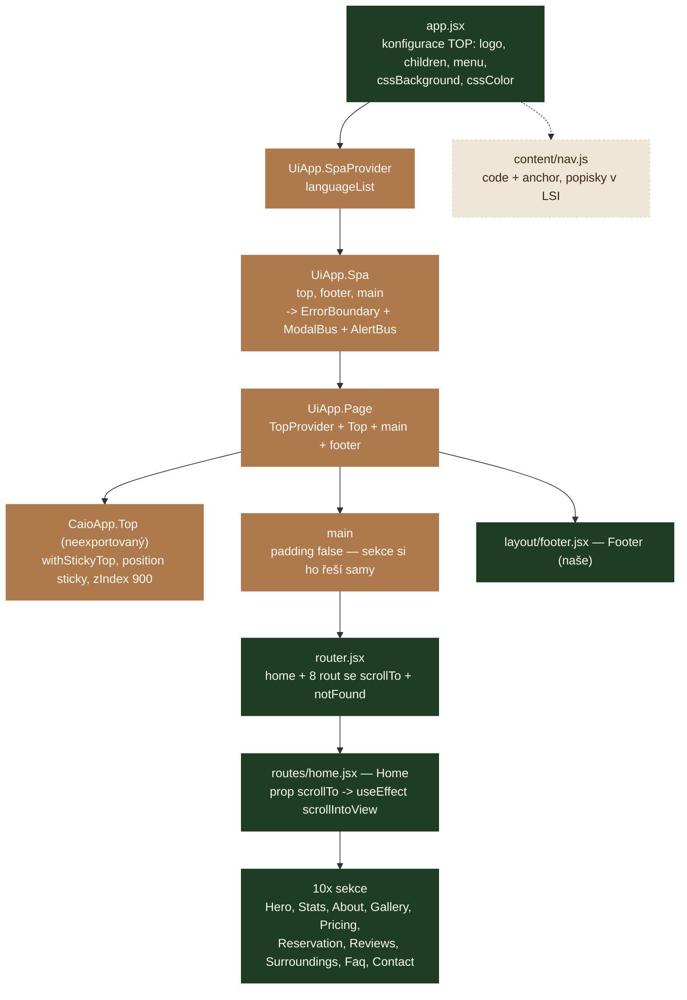
```mermaid
flowchart TD
  app["app.jsx<br/>konfigurace TOP: logo, children, menu,<br/>cssBackground, cssColor"]:::own
  provider["UiApp.SpaProvider<br/>languageList"]:::uu5
  spa["UiApp.Spa<br/>top, footer, main<br/>-> ErrorBoundary + ModalBus + AlertBus"]:::uu5
  cpage["UiApp.Page<br/>TopProvider + Top + main + footer"]:::uu5
  ctop["CaioApp.Top (neexportovaný)<br/>withStickyTop, position sticky, zIndex 900"]:::uu5
  cmain["main<br/>padding false — sekce si ho řeší samy"]:::uu5
  router["router.jsx<br/>home + 8 rout se scrollTo + notFound"]:::own
  home["routes/home.jsx — Home<br/>prop scrollTo -> useEffect scrollIntoView"]:::own
  sections["10x sekce<br/>Hero, Stats, About, Gallery, Pricing,<br/>Reservation, Reviews, Surroundings, Faq, Contact"]:::own
  footer["layout/footer.jsx — Footer (naše)"]:::own
  nav["content/nav.js<br/>code + anchor, popisky v LSI"]:::data

  app --> provider --> spa --> cpage
  cpage --> ctop
  cpage --> cmain
  cpage --> footer
  cmain --> router --> home --> sections
  app -.-> nav

  classDef own fill:#1E3E23,color:#FBF9F0,stroke:#1E3E23
  classDef html fill:#F9F5E8,color:#1E2715,stroke:#DFDBCB
  classDef uu5 fill:#AE794C,color:#FEFCF4,stroke:#AE794C
  classDef data fill:#EDE8D6,color:#3E2815,stroke:#DFDBCB,stroke-dasharray:3 3
```

Sdílené primitivy, na které se odkazují všechny diagramy níž:

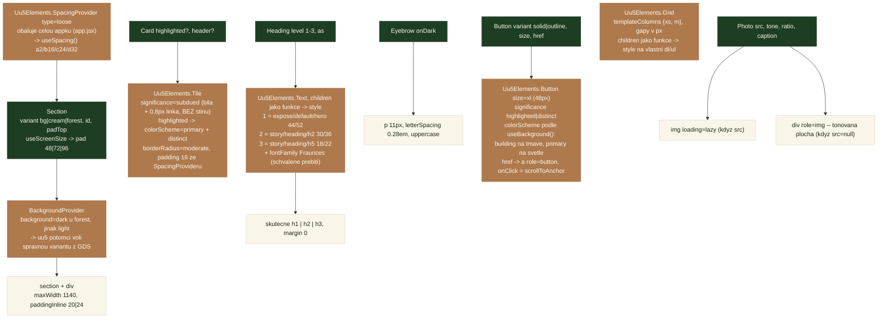
```mermaid
flowchart TD
  spacing["Uu5Elements.SpacingProvider type=loose<br/>obaluje celou appku (app.jsx)<br/>-> useSpacing() a2/b16/c24/d32"]:::uu5

  section["Section<br/>variant bg|cream|forest, id, padTop<br/>useScreenSize -> pad 48|72|96"]:::own
  bgp["BackgroundProvider<br/>background=dark u forest, jinak light<br/>-> uu5 potomci voli spravnou variantu z GDS"]:::uu5
  sectionEl["section + div<br/>maxWidth 1140, paddingInline 20|24"]:::html

  card["Card highlighted?, header?"]:::own
  tile["Uu5Elements.Tile<br/>significance=subdued (bila + 0,8px linka, BEZ stinu)<br/>highlighted -> colorScheme=primary + distinct<br/>borderRadius=moderate, padding 16 ze SpacingProvideru"]:::uu5

  heading["Heading level 1-3, as"]:::own
  text["Uu5Elements.Text, children jako funkce -> style<br/>1 = expose/default/hero 44/52<br/>2 = story/heading/h2 30/36<br/>3 = story/heading/h5 18/22<br/>+ fontFamily Fraunces (schvalene prebiti)"]:::uu5
  headingEl["skutecne h1 | h2 | h3, margin 0"]:::html

  eyebrow["Eyebrow onDark"]:::own
  eyebrowEl["p 11px, letterSpacing 0.28em, uppercase"]:::html

  button["Button variant solid|outline, size, href"]:::own
  uubtn["Uu5Elements.Button size=xl (48px)<br/>significance highlighted|distinct<br/>colorScheme podle useBackground():<br/>building na tmave, primary na svetle<br/>href -> a role=button, onClick = scrollToAnchor"]:::uu5

  grid["Uu5Elements.Grid<br/>templateColumns {xs, m}, gapy v px<br/>children jako funkce -> style na vlastni dl/ul"]:::uu5

  photo["Photo src, tone, ratio, caption"]:::own
  photoImg["img loading=lazy (kdyz src)"]:::html
  photoPh["div role=img -- tonovana plocha (kdyz src=null)"]:::html

  spacing --> section
  section --> bgp --> sectionEl
  card --> tile
  heading --> text --> headingEl
  eyebrow --> eyebrowEl
  button --> uubtn
  photo --> photoImg
  photo --> photoPh

  classDef own fill:#1E3E23,color:#FBF9F0,stroke:#1E3E23
  classDef html fill:#F9F5E8,color:#1E2715,stroke:#DFDBCB
  classDef uu5 fill:#AE794C,color:#FEFCF4,stroke:#AE794C
  classDef data fill:#EDE8D6,color:#3E2815,stroke:#DFDBCB,stroke-dasharray:3 3
```

---

## A.1 Header

Vlastní `layout/header.jsx` **už neexistuje**. Lišta je konfigurace objektu `TOP`
v `client/src/app.jsx`, kterou skládá `CaioApp.Top` z caio-ui.

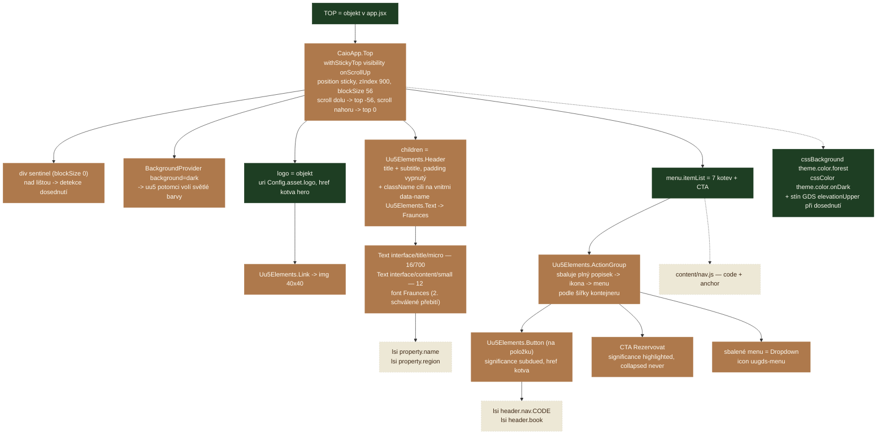
```mermaid
flowchart TD
  TOP["TOP = objekt v app.jsx"]:::own
  T["CaioApp.Top<br/>withStickyTop visibility onScrollUp<br/>position sticky, zIndex 900, blockSize 56<br/>scroll dolu -> top -56, scroll nahoru -> top 0"]:::uu5
  SENT["div sentinel (blockSize 0)<br/>nad lištou -> detekce dosednutí"]:::uu5
  BG["BackgroundProvider background=dark<br/>-> uu5 potomci volí světlé barvy"]:::uu5

  LOGO["logo = objekt<br/>uri Config.asset.logo, href kotva hero"]:::own
  IMG["Uu5Elements.Link -> img 40x40"]:::uu5

  CH["children = Uu5Elements.Header<br/>title + subtitle, padding vypnutý<br/>+ className cili na vnitrni data-name Uu5Elements.Text -> Fraunces"]:::uu5
  CHT["Text interface/title/micro — 16/700<br/>Text interface/content/small — 12<br/>font Fraunces (2. schválené přebití)"]:::uu5
  LSIP["lsi property.name<br/>lsi property.region"]:::data

  MENU["menu.itemList = 7 kotev + CTA"]:::own
  AG["Uu5Elements.ActionGroup<br/>sbaluje plný popisek -> ikona -> menu<br/>podle šířky kontejneru"]:::uu5
  ITEM["Uu5Elements.Button (na položku)<br/>significance subdued, href kotva"]:::uu5
  CTA["CTA Rezervovat<br/>significance highlighted, collapsed never"]:::uu5
  HAM["sbalené menu = Dropdown<br/>icon uugds-menu"]:::uu5
  LSIN["lsi header.nav.CODE<br/>lsi header.book"]:::data
  NAVD["content/nav.js — code + anchor"]:::data

  CSS["cssBackground theme.color.forest<br/>cssColor theme.color.onDark<br/>+ stín GDS elevationUpper při dosednutí"]:::own

  TOP --> T
  T --> SENT
  T --> BG
  T --> LOGO --> IMG
  T --> CH --> CHT --> LSIP
  T --> MENU --> AG
  AG --> ITEM --> LSIN
  AG --> CTA
  AG --> HAM
  MENU -.-> NAVD
  T -.-> CSS

  classDef own fill:#1E3E23,color:#FBF9F0,stroke:#1E3E23
  classDef html fill:#F9F5E8,color:#1E2715,stroke:#DFDBCB
  classDef uu5 fill:#AE794C,color:#FEFCF4,stroke:#AE794C
  classDef data fill:#EDE8D6,color:#3E2815,stroke:#DFDBCB,stroke-dasharray:3 3
```

**Chování:** lišta je `position: sticky` (ne `fixed`), takže zůstává v toku a hero ji
nemusí odsazovat. Zelená je nahoře i po odscrollování; po dosednutí přidá GDS stín.
Od 2026-09-03 je `sticky` **`"onScrollUp"`** (default `caio-ui`): při scrollu dolů lišta
odjede nad hranu viewportu (`top: -56px`) a vrátí se, jakmile uživatel scrolluje nahoru.
Naměřeno v prohlížeči: scroll dolů → `top: -56px`, scroll nahoru → `top: 0` s přechodem,
na vrcholu stránky lišta v toku a bez stínu. Mechanika je popsaná v `caio-ui/README.md`.
Dosednutí si `Top` detekuje sám sentinelem + scroll listenerem — `stickyTopStuck`
z `withStickyTop` na stránce scrollované oknem nefunguje (viz Known issues v `caio-ui/README.md`).
Pozor: `stuck` znamená „scrollovali jsme za lištu", ne „lišta je vidět" — odjetá lišta
je pořád `stuck`.
Vzhled se dá na dosednutí navázat funkčním tvarem propsů (`cssBackground: ({ stuck }) => …`)
a obsah stránky si stav přečte přes `UiApp.useTop()`.

**Co se proti vlastní hlavičce ztratilo:** průhledná lišta nad hero se světlým textem
(dnes je zelená všude) a nav odkazy jsou `Uu5Elements.Button significance="subdued"`,
ne textové `<a>`. **Fraunces v názvu se naopak vrátil** (2026-09-03): `Uu5Elements.Header`
sází `title` i `subtitle` jako `Uu5Elements.Text` s vlastní explicitní `font-family`, takže
dědění z `Header`u nestačí — `app.jsx` proto cílí `className`em na
`[data-name="Uu5Elements.Text"]` uvnitř. Vyšší specificita (třída + atribut) přebije uu5
třídu bez ohledu na pořadí stylesheetů. Stupně zůstávají z GDS (16/700 a 12), jen v Fraunces.
Je to druhé místo, kde se Fraunces dosazuje `className`em (první je `Heading`) — soupis
všech přebití v kódu je v [§ B.0](#b0-co-z-uu5-jde-a-co-ne-měřeno-ne-odhadem).

---

## A.2 Welcome / Hero

`client/src/components/sections/hero.jsx`

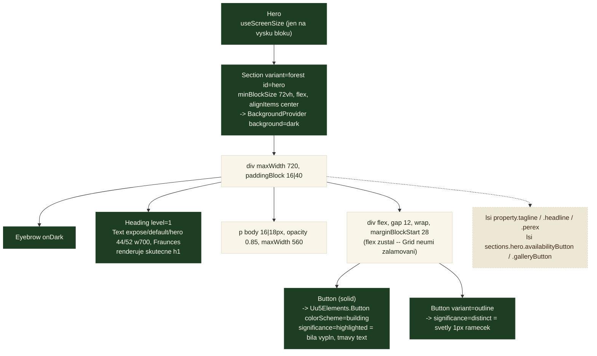
```mermaid
flowchart TD
  HERO["Hero<br/>useScreenSize (jen na vysku bloku)"]:::own
  S["Section variant=forest id=hero<br/>minBlockSize 72vh, flex, alignItems center<br/>-> BackgroundProvider background=dark"]:::own
  W["div maxWidth 720, paddingBlock 16|40"]:::html
  E["Eyebrow onDark"]:::own
  HD["Heading level=1<br/>Text expose/default/hero 44/52 w700, Fraunces<br/>renderuje skutecne h1"]:::own
  P["p body 16|18px, opacity 0.85, maxWidth 560"]:::html
  ROW["div flex, gap 12, wrap, marginBlockStart 28<br/>(flex zustal -- Grid neumi zalamovani)"]:::html
  B1["Button (solid)<br/>-> Uu5Elements.Button colorScheme=building<br/>significance=highlighted = bila vypln, tmavy text"]:::own
  B2["Button variant=outline<br/>-> significance=distinct = svetly 1px ramecek"]:::own
  D["lsi property.tagline / .headline / .perex<br/>lsi sections.hero.availabilityButton / .galleryButton"]:::data

  HERO --> S --> W
  W --> E
  W --> HD
  W --> P
  W --> ROW
  ROW --> B1
  ROW --> B2
  W -.-> D

  classDef own fill:#1E3E23,color:#FBF9F0,stroke:#1E3E23
  classDef html fill:#F9F5E8,color:#1E2715,stroke:#DFDBCB
  classDef uu5 fill:#AE794C,color:#FEFCF4,stroke:#AE794C
  classDef data fill:#EDE8D6,color:#3E2815,stroke:#DFDBCB,stroke-dasharray:3 3
```

Fotka zatím není — je to plný forest blok; výměna za fotku bude doplnění `backgroundImage`,
kompozice se nemění. Z uu5 tu jsou `Text` (přes `Heading`) a dvě `Button`y (přes náš obal),
tlačítka si tmavý podklad čtou z `BackgroundProvider`u sekce, ne z propu. Ruční zůstal
perex `<p>` a řádek tlačítek — `flex` kvůli zalamování, které `Grid` neumí.

---

## A.3 Stats (pruh se čtyřmi čísly)

`client/src/components/sections/stats.jsx` — v zadání nebyl, ale na stránce je, mezi Hero
a O roubence.

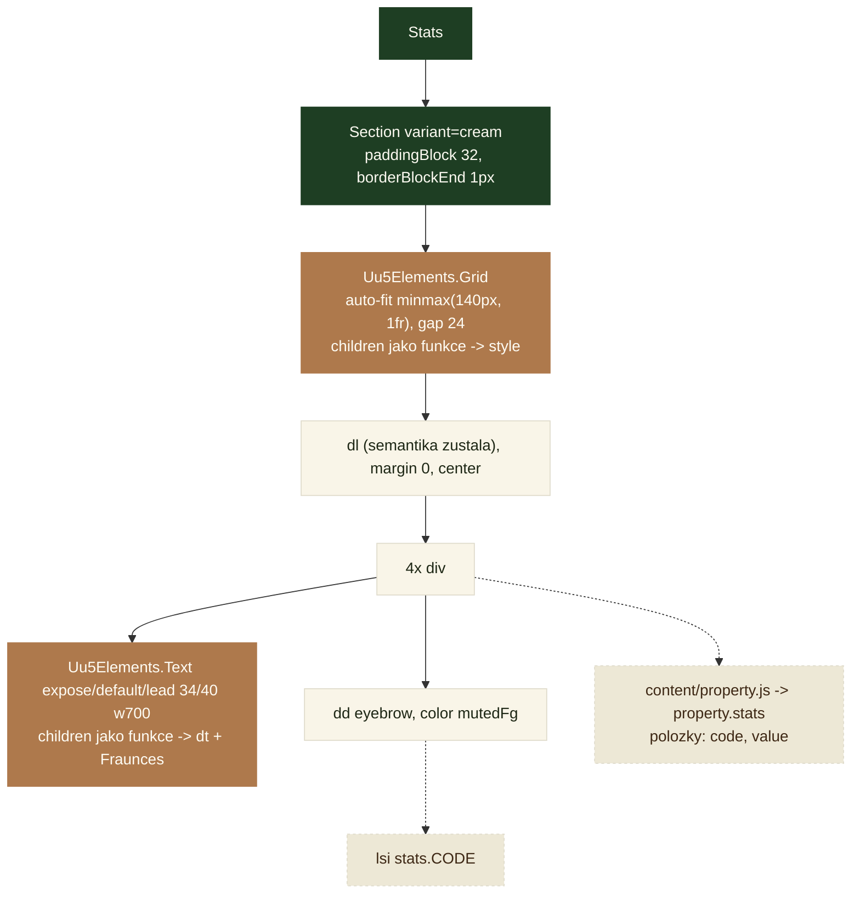
```mermaid
flowchart TD
  ST["Stats"]:::own
  S["Section variant=cream<br/>paddingBlock 32, borderBlockEnd 1px"]:::own
  G["Uu5Elements.Grid<br/>auto-fit minmax(140px, 1fr), gap 24<br/>children jako funkce -> style"]:::uu5
  DL["dl (semantika zustala), margin 0, center"]:::html
  IT["4x div"]:::html
  DT["Uu5Elements.Text expose/default/lead 34/40 w700<br/>children jako funkce -> dt + Fraunces"]:::uu5
  DD["dd eyebrow, color mutedFg"]:::html
  DATA["content/property.js -> property.stats<br/>polozky: code, value"]:::data
  L["lsi stats.CODE"]:::data

  ST --> S --> G --> DL --> IT
  IT --> DT
  IT --> DD
  IT -.-> DATA
  DD -.-> L

  classDef own fill:#1E3E23,color:#FBF9F0,stroke:#1E3E23
  classDef html fill:#F9F5E8,color:#1E2715,stroke:#DFDBCB
  classDef uu5 fill:#AE794C,color:#FEFCF4,stroke:#AE794C
  classDef data fill:#EDE8D6,color:#3E2815,stroke:#DFDBCB,stroke-dasharray:3 3
```

---

## A.4 O roubence

`client/src/components/sections/about.jsx`

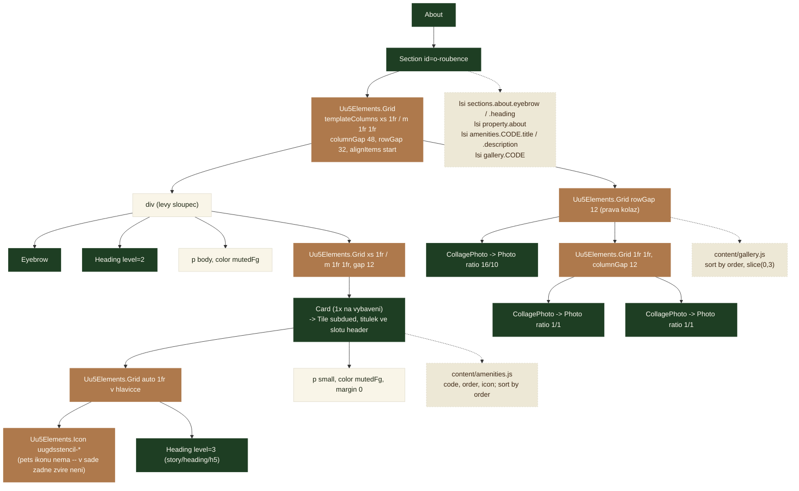
```mermaid
flowchart TD
  AB["About"]:::own
  S["Section id=o-roubence"]:::own
  G["Uu5Elements.Grid<br/>templateColumns xs 1fr / m 1fr 1fr<br/>columnGap 48, rowGap 32, alignItems start"]:::uu5

  L["div (levy sloupec)"]:::html
  E["Eyebrow"]:::own
  H["Heading level=2"]:::own
  P["p body, color mutedFg"]:::html
  AG["Uu5Elements.Grid xs 1fr / m 1fr 1fr, gap 12"]:::uu5
  AC["Card (1x na vybaveni)<br/>-> Tile subdued, titulek ve slotu header"]:::own
  AHG["Uu5Elements.Grid auto 1fr v hlavicce"]:::uu5
  ICO["Uu5Elements.Icon uugdsstencil-*<br/>(pets ikonu nema -- v sade zadne zvire neni)"]:::uu5
  AH["Heading level=3 (story/heading/h5)"]:::own
  AP["p small, color mutedFg, margin 0"]:::html

  R["Uu5Elements.Grid rowGap 12 (prava kolaz)"]:::uu5
  CP1["CollagePhoto -> Photo ratio 16/10"]:::own
  CR["Uu5Elements.Grid 1fr 1fr, columnGap 12"]:::uu5
  CP2["CollagePhoto -> Photo ratio 1/1"]:::own
  CP3["CollagePhoto -> Photo ratio 1/1"]:::own

  DA["content/amenities.js<br/>code, order, icon; sort by order"]:::data
  DG["content/gallery.js<br/>sort by order, slice(0,3)"]:::data
  LS["lsi sections.about.eyebrow / .heading<br/>lsi property.about<br/>lsi amenities.CODE.title / .description<br/>lsi gallery.CODE"]:::data

  AB --> S --> G
  G --> L
  L --> E
  L --> H
  L --> P
  L --> AG --> AC
  AC --> AHG
  AHG --> ICO
  AHG --> AH
  AC --> AP
  AC -.-> DA
  G --> R
  R --> CP1
  R --> CR
  CR --> CP2
  CR --> CP3
  R -.-> DG
  S -.-> LS

  classDef own fill:#1E3E23,color:#FBF9F0,stroke:#1E3E23
  classDef html fill:#F9F5E8,color:#1E2715,stroke:#DFDBCB
  classDef uu5 fill:#AE794C,color:#FEFCF4,stroke:#AE794C
  classDef data fill:#EDE8D6,color:#3E2815,stroke:#DFDBCB,stroke-dasharray:3 3
```

Koláž bere první tři fotky ze stejného zdroje jako galerie, aby se to nerozešlo.

---

## A.5 Galerie

`client/src/components/sections/gallery.jsx`

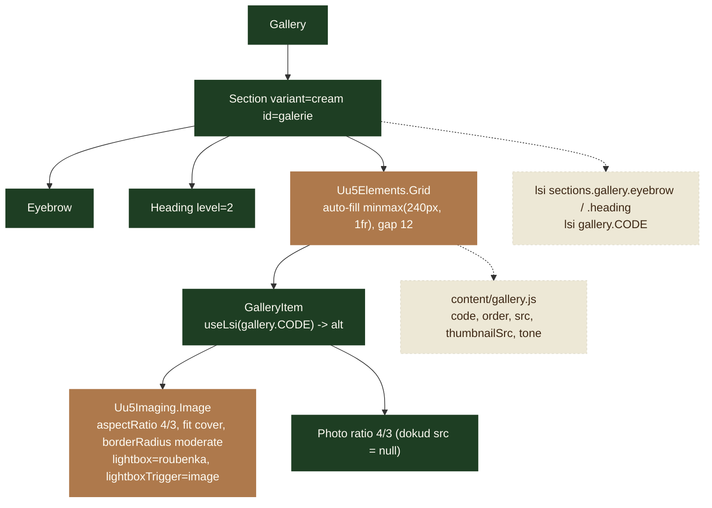
```mermaid
flowchart TD
  GA["Gallery"]:::own
  S["Section variant=cream id=galerie"]:::own
  E["Eyebrow"]:::own
  H["Heading level=2"]:::own
  G["Uu5Elements.Grid<br/>auto-fill minmax(240px, 1fr), gap 12"]:::uu5
  GI["GalleryItem<br/>useLsi(gallery.CODE) -> alt"]:::own
  IMG["Uu5Imaging.Image<br/>aspectRatio 4/3, fit cover, borderRadius moderate<br/>lightbox=roubenka, lightboxTrigger=image"]:::uu5
  PH["Photo ratio 4/3 (dokud src = null)"]:::own
  D["content/gallery.js<br/>code, order, src, thumbnailSrc, tone"]:::data
  L["lsi sections.gallery.eyebrow / .heading<br/>lsi gallery.CODE"]:::data

  GA --> S
  S --> E
  S --> H
  S --> G --> GI
  GI --> IMG
  GI --> PH
  G -.-> D
  S -.-> L

  classDef own fill:#1E3E23,color:#FBF9F0,stroke:#1E3E23
  classDef html fill:#F9F5E8,color:#1E2715,stroke:#DFDBCB
  classDef uu5 fill:#AE794C,color:#FEFCF4,stroke:#AE794C
  classDef data fill:#EDE8D6,color:#3E2815,stroke:#DFDBCB,stroke-dasharray:3 3
```

Lightbox dodává `Uu5Imaging.Image` sám: dlaždice se stejným `lightbox` tvoří jednu skupinu
s průchodem, zoomem i fullscreenem, takže vlastní `openIndex` ani `Modal` v kódu nejsou
(hotovo 2026-09-02).

---

## A.6 Ceník

`client/src/components/sections/pricing.jsx`

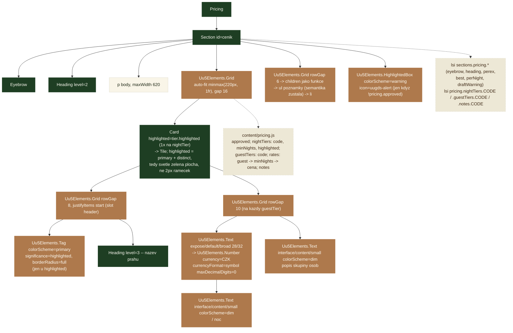
```mermaid
flowchart TD
  PR["Pricing"]:::own
  S["Section id=cenik"]:::own
  E["Eyebrow"]:::own
  H["Heading level=2"]:::own
  P["p body, maxWidth 620"]:::html
  G["Uu5Elements.Grid<br/>auto-fit minmax(220px, 1fr), gap 16"]:::uu5

  C["Card highlighted=tier.highlighted (1x na nightTier)<br/>-> Tile; highlighted = primary + distinct,<br/>tedy svetle zelena plocha, ne 2px ramecek"]:::own
  HG["Uu5Elements.Grid rowGap 8, justifyItems start (slot header)"]:::uu5
  TAG["Uu5Elements.Tag colorScheme=primary<br/>significance=highlighted, borderRadius=full<br/>(jen u highlighted)"]:::uu5
  TH["Heading level=3 -- nazev prahu"]:::own
  GT["Uu5Elements.Grid rowGap 10 (na kazdy guestTier)"]:::uu5
  PRICE["Uu5Elements.Text expose/default/broad 28/32<br/>-> Uu5Elements.Number currency=CZK<br/>currencyFormat=symbol maxDecimalDigits=0"]:::uu5
  PNIGHT["Uu5Elements.Text interface/content/small colorScheme=dim<br/>/ noc"]:::uu5
  GLAB["Uu5Elements.Text interface/content/small colorScheme=dim<br/>popis skupiny osob"]:::uu5

  UL["Uu5Elements.Grid rowGap 6 -> children jako funkce<br/>-> ul poznamky (semantika zustala) -> li"]:::uu5
  WARN["Uu5Elements.HighlightedBox colorScheme=warning<br/>icon=uugds-alert (jen kdyz !pricing.approved)"]:::uu5

  D["content/pricing.js<br/>approved; nightTiers: code, minNights, highlighted;<br/>guestTiers: code; rates: guest -> minNights -> cena; notes"]:::data
  L["lsi sections.pricing.* (eyebrow, heading, perex,<br/>best, perNight, draftWarning)<br/>lsi pricing.nightTiers.CODE / .guestTiers.CODE / .notes.CODE"]:::data

  PR --> S
  S --> E
  S --> H
  S --> P
  S --> G --> C
  C --> HG
  HG --> TAG
  HG --> TH
  C --> GT
  GT --> PRICE --> PNIGHT
  GT --> GLAB
  S --> UL
  S --> WARN
  G -.-> D
  S -.-> L

  classDef own fill:#1E3E23,color:#FBF9F0,stroke:#1E3E23
  classDef html fill:#F9F5E8,color:#1E2715,stroke:#DFDBCB
  classDef uu5 fill:#AE794C,color:#FEFCF4,stroke:#AE794C
  classDef data fill:#EDE8D6,color:#3E2815,stroke:#DFDBCB,stroke-dasharray:3 3
```

---

## A.7 Rezervace

`client/src/components/sections/reservation.jsx` + `components/reservation/*` —
jediná část webu, která komunikuje se serverem.

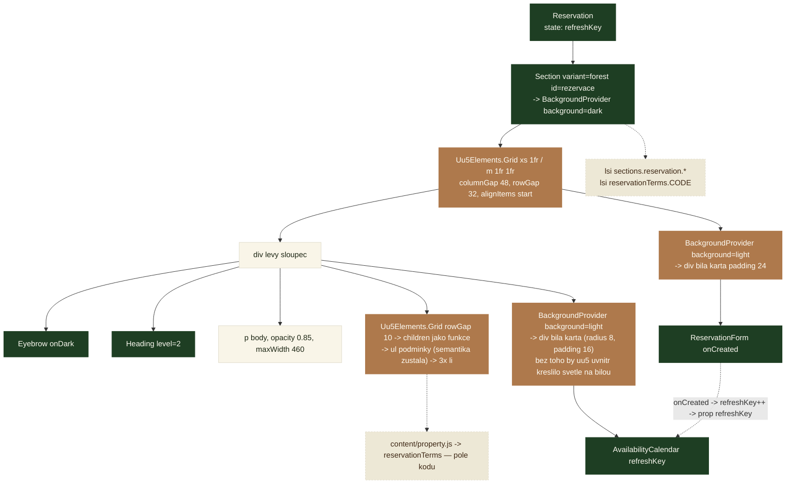
```mermaid
flowchart TD
  RS["Reservation<br/>state: refreshKey"]:::own
  S["Section variant=forest id=rezervace<br/>-> BackgroundProvider background=dark"]:::own
  G["Uu5Elements.Grid xs 1fr / m 1fr 1fr<br/>columnGap 48, rowGap 32, alignItems start"]:::uu5

  L["div levy sloupec"]:::html
  E["Eyebrow onDark"]:::own
  H["Heading level=2"]:::own
  P["p body, opacity 0.85, maxWidth 460"]:::html
  UL["Uu5Elements.Grid rowGap 10 -> children jako funkce<br/>-> ul podminky (semantika zustala) -> 3x li"]:::uu5
  CW["BackgroundProvider background=light<br/>-> div bila karta (radius 8, padding 16)<br/>bez toho by uu5 uvnitr kreslilo svetle na bilou"]:::uu5
  AC["AvailabilityCalendar refreshKey"]:::own

  R["BackgroundProvider background=light<br/>-> div bila karta padding 24"]:::uu5
  RF["ReservationForm onCreated"]:::own

  D["content/property.js -> reservationTerms — pole kodu"]:::data
  LS["lsi sections.reservation.*<br/>lsi reservationTerms.CODE"]:::data

  RS --> S --> G
  G --> L
  L --> E
  L --> H
  L --> P
  L --> UL
  L --> CW --> AC
  G --> R --> RF
  UL -.-> D
  S -.-> LS
  RF -.->|"onCreated -> refreshKey++ -> prop refreshKey"| AC

  classDef own fill:#1E3E23,color:#FBF9F0,stroke:#1E3E23
  classDef html fill:#F9F5E8,color:#1E2715,stroke:#DFDBCB
  classDef uu5 fill:#AE794C,color:#FEFCF4,stroke:#AE794C
  classDef data fill:#EDE8D6,color:#3E2815,stroke:#DFDBCB,stroke-dasharray:3 3
```

### A.7a AvailabilityCalendar

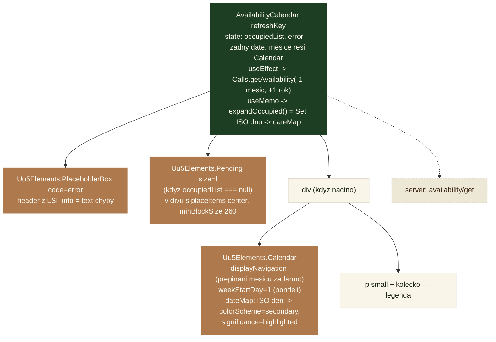
```mermaid
flowchart TD
  AC["AvailabilityCalendar refreshKey<br/>state: occupiedList, error -- zadny date, mesice resi Calendar<br/>useEffect -> Calls.getAvailability(-1 mesic, +1 rok)<br/>useMemo -> expandOccupied() = Set ISO dnu -> dateMap"]:::own
  ERR["Uu5Elements.PlaceholderBox code=error<br/>header z LSI, info = text chyby"]:::uu5
  PEND["Uu5Elements.Pending size=l<br/>(kdyz occupiedList === null)<br/>v divu s placeItems center, minBlockSize 260"]:::uu5
  OK["div (kdyz nactno)"]:::html
  CAL["Uu5Elements.Calendar<br/>displayNavigation (prepinani mesicu zadarmo)<br/>weekStartDay=1 (pondeli)<br/>dateMap: ISO den -> colorScheme=secondary,<br/>significance=highlighted"]:::uu5
  LEG["p small + kolecko — legenda"]:::html
  API["server: availability/get"]:::data

  AC --> ERR
  AC --> PEND
  AC --> OK
  OK --> CAL
  OK --> LEG
  AC -.-> API

  classDef own fill:#1E3E23,color:#FBF9F0,stroke:#1E3E23
  classDef html fill:#F9F5E8,color:#1E2715,stroke:#DFDBCB
  classDef uu5 fill:#AE794C,color:#FEFCF4,stroke:#AE794C
  classDef data fill:#EDE8D6,color:#3E2815,stroke:#DFDBCB,stroke-dasharray:3 3
```

Přepínání měsíců dodává `Uu5Elements.Calendar` sám (`displayNavigation`), obsazené dny
obarví `dateMap` — ruční hlavička měsíce, `shift()` i `renderDayIndicator` zmizely
(hotovo 2026-09-02).

### A.7b ReservationForm

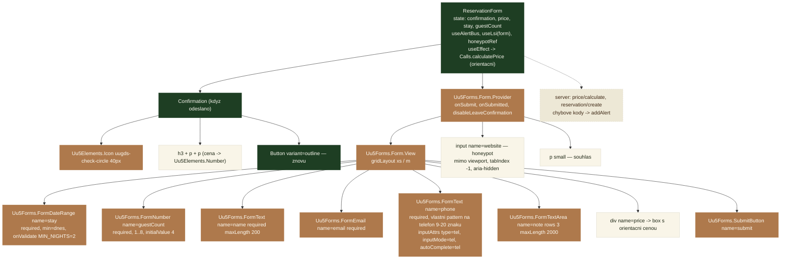
```mermaid
flowchart TD
  RF["ReservationForm<br/>state: confirmation, price, stay, guestCount<br/>useAlertBus, useLsi(form), honeypotRef<br/>useEffect -> Calls.calculatePrice (orientacni)"]:::own
  CONF["Confirmation (kdyz odeslano)"]:::own
  CI["Uu5Elements.Icon uugds-check-circle 40px"]:::uu5
  CH["h3 + p + p (cena -> Uu5Elements.Number)"]:::html
  CB["Button variant=outline — znovu"]:::own

  FP["Uu5Forms.Form.Provider<br/>onSubmit, onSubmitted, disableLeaveConfirmation"]:::uu5
  FV["Uu5Forms.Form.View<br/>gridLayout xs / m"]:::uu5
  F1["Uu5Forms.FormDateRange name=stay<br/>required, min=dnes, onValidate MIN_NIGHTS=2"]:::uu5
  F2["Uu5Forms.FormNumber name=guestCount<br/>required, 1..8, initialValue 4"]:::uu5
  F3["Uu5Forms.FormText name=name required maxLength 200"]:::uu5
  F4["Uu5Forms.FormEmail name=email required"]:::uu5
  F5["Uu5Forms.FormText name=phone<br/>required, vlastni pattern na telefon 9-20 znaku<br/>inputAttrs type=tel, inputMode=tel, autoComplete=tel"]:::uu5
  F6["Uu5Forms.FormTextArea name=note rows 3 maxLength 2000"]:::uu5
  F7["div name=price -> box s orientacni cenou"]:::html
  F8["Uu5Forms.SubmitButton name=submit"]:::uu5
  HP["input name=website — honeypot<br/>mimo viewport, tabIndex -1, aria-hidden"]:::html
  CONS["p small — souhlas"]:::html
  API["server: price/calculate, reservation/create<br/>chybove kody -> addAlert"]:::data

  RF --> CONF
  CONF --> CI
  CONF --> CH
  CONF --> CB
  RF --> FP --> FV
  FV --> F1
  FV --> F2
  FV --> F3
  FV --> F4
  FV --> F5
  FV --> F6
  FV --> F7
  FV --> F8
  FP --> HP
  FP --> CONS
  RF -.-> API

  classDef own fill:#1E3E23,color:#FBF9F0,stroke:#1E3E23
  classDef html fill:#F9F5E8,color:#1E2715,stroke:#DFDBCB
  classDef uu5 fill:#AE794C,color:#FEFCF4,stroke:#AE794C
  classDef data fill:#EDE8D6,color:#3E2815,stroke:#DFDBCB,stroke-dasharray:3 3
```

Formulář byl na uu5 první — dnes na něm stojí celý web. Ruční tu zůstaly jen tři věci:
honeypot `<input>` (musí být mimo viewport i mimo tab order, žádná uu5 komponenta to nedělá),
box s orientační cenou a `Confirmation`. `Confirmation` je zatím ruční `Icon` + `<h3>` + `<p>`
místo `PlaceholderBox code="success"` — poslední otevřený bod z tabulky
[§ B.13](#b13-souhrn-doporučení-podle-výnosu) — a jeho `Uu5Elements.Icon` nese
`className` s `fontSize: 40` a barvou, což je **jediné přebití v kódu, které neprošlo
schválením** (viz [§ B.0](#b0-co-z-uu5-jde-a-co-ne-měřeno-ne-odhadem)).
`PlaceholderBox` by ho odstranil spolu s ručním `<h3>`.

---

## A.8 Recenze

`client/src/components/sections/reviews.jsx`

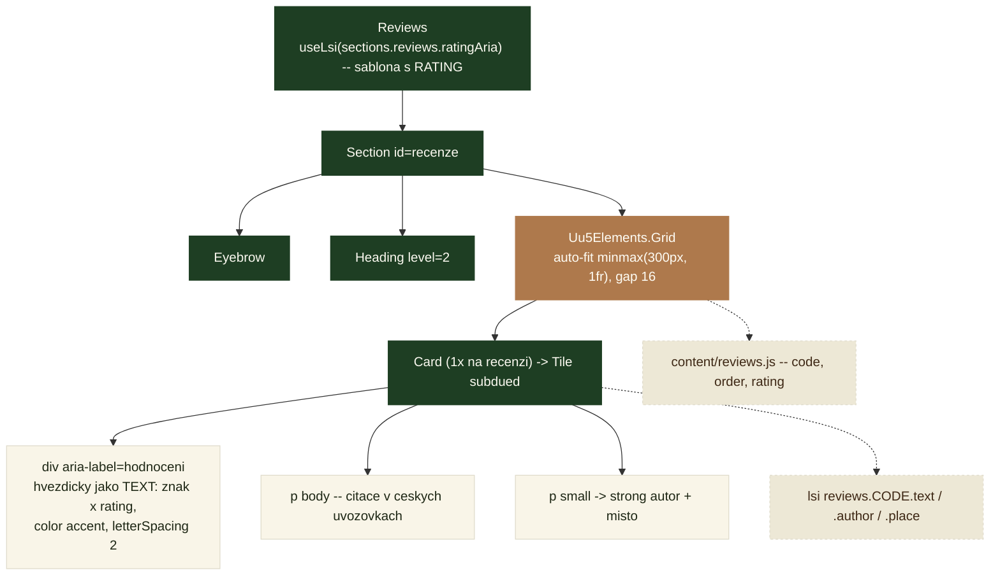
```mermaid
flowchart TD
  RV["Reviews<br/>useLsi(sections.reviews.ratingAria) -- sablona s RATING"]:::own
  S["Section id=recenze"]:::own
  E["Eyebrow"]:::own
  H["Heading level=2"]:::own
  G["Uu5Elements.Grid<br/>auto-fit minmax(300px, 1fr), gap 16"]:::uu5
  C["Card (1x na recenzi) -> Tile subdued"]:::own
  ST["div aria-label=hodnoceni<br/>hvezdicky jako TEXT: znak x rating,<br/>color accent, letterSpacing 2"]:::html
  TX["p body -- citace v ceskych uvozovkach"]:::html
  AU["p small -> strong autor + misto"]:::html
  D["content/reviews.js -- code, order, rating"]:::data
  L["lsi reviews.CODE.text / .author / .place"]:::data

  RV --> S
  S --> E
  S --> H
  S --> G --> C
  C --> ST
  C --> TX
  C --> AU
  G -.-> D
  C -.-> L

  classDef own fill:#1E3E23,color:#FBF9F0,stroke:#1E3E23
  classDef html fill:#F9F5E8,color:#1E2715,stroke:#DFDBCB
  classDef uu5 fill:#AE794C,color:#FEFCF4,stroke:#AE794C
  classDef data fill:#EDE8D6,color:#3E2815,stroke:#DFDBCB,stroke-dasharray:3 3
```

---

## A.9 Zajímavosti v okolí

`client/src/components/sections/surroundings.jsx`

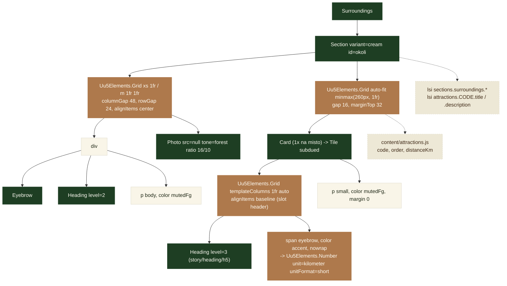
```mermaid
flowchart TD
  SU["Surroundings"]:::own
  S["Section variant=cream id=okoli"]:::own
  T["Uu5Elements.Grid xs 1fr / m 1fr 1fr<br/>columnGap 48, rowGap 24, alignItems center"]:::uu5
  TL["div"]:::html
  E["Eyebrow"]:::own
  H["Heading level=2"]:::own
  P["p body, color mutedFg"]:::html
  PH["Photo src=null tone=forest ratio 16/10"]:::own

  G["Uu5Elements.Grid auto-fit minmax(260px, 1fr)<br/>gap 16, marginTop 32"]:::uu5
  C["Card (1x na misto) -> Tile subdued"]:::own
  ROW["Uu5Elements.Grid templateColumns 1fr auto<br/>alignItems baseline (slot header)"]:::uu5
  CH["Heading level=3 (story/heading/h5)"]:::own
  DIST["span eyebrow, color accent, nowrap<br/>-> Uu5Elements.Number unit=kilometer unitFormat=short"]:::uu5
  CP["p small, color mutedFg, margin 0"]:::html

  D["content/attractions.js<br/>code, order, distanceKm"]:::data
  L["lsi sections.surroundings.*<br/>lsi attractions.CODE.title / .description"]:::data

  SU --> S
  S --> T
  T --> TL
  TL --> E
  TL --> H
  TL --> P
  T --> PH
  S --> G --> C
  C --> ROW
  ROW --> CH
  ROW --> DIST
  C --> CP
  G -.-> D
  S -.-> L

  classDef own fill:#1E3E23,color:#FBF9F0,stroke:#1E3E23
  classDef html fill:#F9F5E8,color:#1E2715,stroke:#DFDBCB
  classDef uu5 fill:#AE794C,color:#FEFCF4,stroke:#AE794C
  classDef data fill:#EDE8D6,color:#3E2815,stroke:#DFDBCB,stroke-dasharray:3 3
```

---

## A.10 Časté dotazy

`client/src/components/sections/faq.jsx`

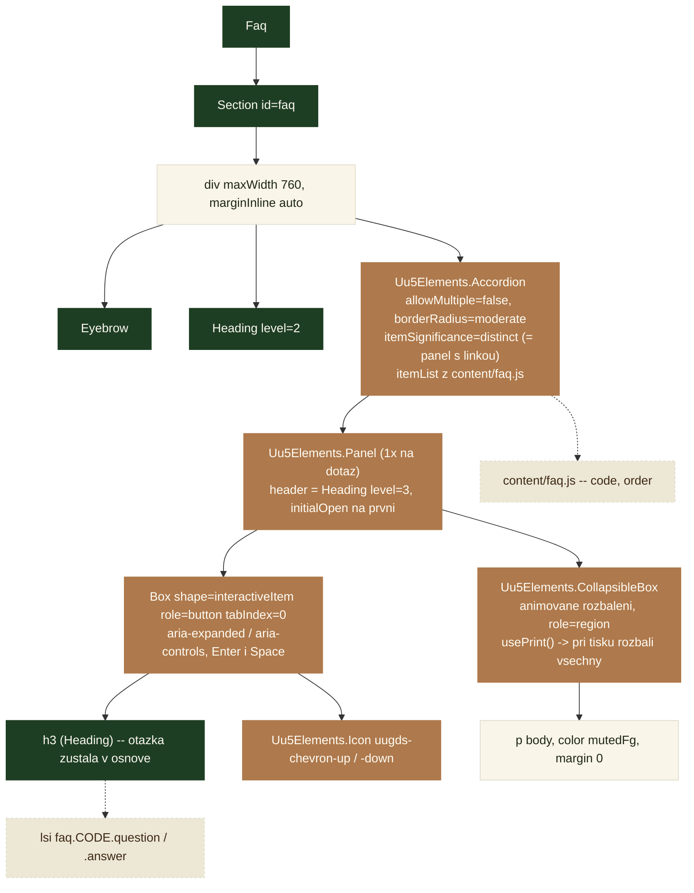
```mermaid
flowchart TD
  FQ["Faq"]:::own
  S["Section id=faq"]:::own
  W["div maxWidth 760, marginInline auto"]:::html
  E["Eyebrow"]:::own
  H["Heading level=2"]:::own
  A["Uu5Elements.Accordion<br/>allowMultiple=false, borderRadius=moderate<br/>itemSignificance=distinct (= panel s linkou)<br/>itemList z content/faq.js"]:::uu5
  PAN["Uu5Elements.Panel (1x na dotaz)<br/>header = Heading level=3, initialOpen na prvni"]:::uu5
  BX["Box shape=interactiveItem role=button tabIndex=0<br/>aria-expanded / aria-controls, Enter i Space"]:::uu5
  H3["h3 (Heading) -- otazka zustala v osnove"]:::own
  ICO["Uu5Elements.Icon uugds-chevron-up / -down"]:::uu5
  CB["Uu5Elements.CollapsibleBox<br/>animovane rozbaleni, role=region<br/>usePrint() -> pri tisku rozbali vsechny"]:::uu5
  ANS["p body, color mutedFg, margin 0"]:::html
  D["content/faq.js -- code, order"]:::data
  L["lsi faq.CODE.question / .answer"]:::data

  FQ --> S --> W
  W --> E
  W --> H
  W --> A --> PAN
  PAN --> BX
  BX --> H3
  BX --> ICO
  PAN --> CB --> ANS
  A -.-> D
  H3 -.-> L

  classDef own fill:#1E3E23,color:#FBF9F0,stroke:#1E3E23
  classDef html fill:#F9F5E8,color:#1E2715,stroke:#DFDBCB
  classDef uu5 fill:#AE794C,color:#FEFCF4,stroke:#AE794C
  classDef data fill:#EDE8D6,color:#3E2815,stroke:#DFDBCB,stroke-dasharray:3 3
```

Ruční accordion (~30 řádků) i `useState(openCode)` zmizely 2026-09-03. Otázka je obráceně
než dřív: `<h3>` (náš `Heading`) je **uvnitř** hlavičky panelu, což je `Box` s `role="button"`
a `tabIndex={0}` — ne `<button>` v `<h3>`. Osnova dokumentu zůstala, zanoření nadpisu
v `role="button"` je uvážený kompromis, viz [§ B.10](#b10-časté-dotazy--uu5elementsaccordion).
Rozbalení je animované (`CollapsibleBox`), při tisku se přes `usePrint()` rozbalí všechny
panely a celé ARIA drátování (`aria-expanded`, `aria-controls`, `role="region"`) dodá
`Accordion` sám. Pozor na mapování v `Panel`u: `significance` se na obal **překládá**
(`{distinct: "subdued"}`), takže rámeček dá `itemSignificance="distinct"`, ne `"subdued"`.

---

## A.11 Kontakt

`client/src/components/sections/contact.jsx`

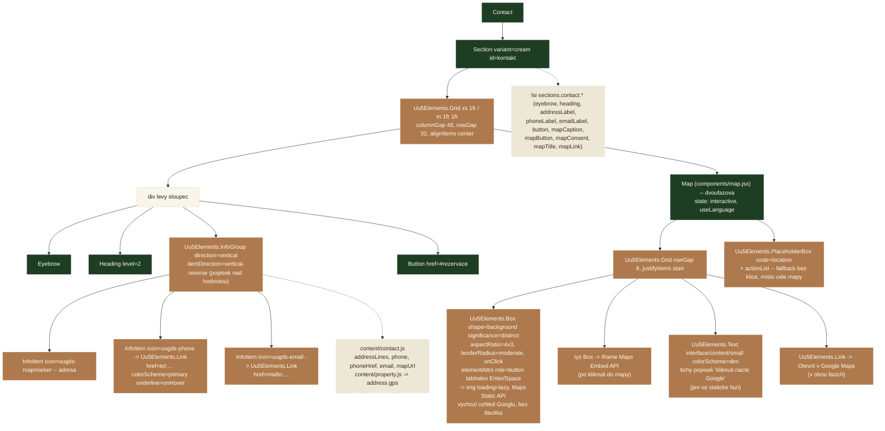
```mermaid
flowchart TD
  CO["Contact"]:::own
  S["Section variant=cream id=kontakt"]:::own
  G["Uu5Elements.Grid xs 1fr / m 1fr 1fr<br/>columnGap 48, rowGap 32, alignItems center"]:::uu5
  L["div levy sloupec"]:::html
  E["Eyebrow"]:::own
  H["Heading level=2"]:::own
  IG["Uu5Elements.InfoGroup direction=vertical<br/>itemDirection=vertical-reverse (popisek nad hodnotou)"]:::uu5
  I1["InfoItem icon=uugds-mapmarker -- adresa"]:::uu5
  I2["InfoItem icon=uugds-phone -> Uu5Elements.Link<br/>href=tel:… colorScheme=primary underline=onHover"]:::uu5
  I3["InfoItem icon=uugds-email -> Uu5Elements.Link<br/>href=mailto:…"]:::uu5
  B["Button href=#rezervace"]:::own
  MAP["Map (components/map.jsx) -- dvoufazova<br/>state: interactive, useLanguage"]:::own
  MG["Uu5Elements.Grid rowGap 8, justifyItems start"]:::uu5
  IMG["Uu5Elements.Box shape=background significance=distinct<br/>aspectRatio=4x3, borderRadius=moderate, onClick<br/>elementAttrs role=button tabIndex Enter/Space<br/>-> img loading=lazy, Maps Static API<br/>vychozi vzhled Googlu, bez tlacitka"]:::uu5
  IFR["tyz Box -> iframe Maps Embed API<br/>(po kliknuti do mapy)"]:::uu5
  CONS["Uu5Elements.Text interface/content/small colorScheme=dim<br/>tichy popisek 'kliknuti nacte Google'<br/>(jen ve staticke fazi)"]:::uu5
  PB["Uu5Elements.PlaceholderBox code=location<br/>+ actionList -- fallback bez klice, misto cele mapy"]:::uu5
  LNK["Uu5Elements.Link -> Otevrit v Google Maps<br/>(v obou fazich)"]:::uu5
  D["content/contact.js<br/>addressLines, phone, phoneHref, email, mapUrl<br/>content/property.js -> address.gps"]:::data
  LS["lsi sections.contact.* (eyebrow, heading, addressLabel,<br/>phoneLabel, emailLabel, button, mapCaption,<br/>mapButton, mapConsent, mapTitle, mapLink)"]:::data

  CO --> S --> G
  G --> L
  L --> E
  L --> H
  L --> IG
  IG --> I1
  IG --> I2
  IG --> I3
  L --> B
  G --> MAP
  MAP --> PB
  MAP --> MG
  MG --> IMG
  MG --> IFR
  MG --> CONS
  MG --> LNK
  IG -.-> D
  S -.-> LS

  classDef own fill:#1E3E23,color:#FBF9F0,stroke:#1E3E23
  classDef html fill:#F9F5E8,color:#1E2715,stroke:#DFDBCB
  classDef uu5 fill:#AE794C,color:#FEFCF4,stroke:#AE794C
  classDef data fill:#EDE8D6,color:#3E2815,stroke:#DFDBCB,stroke-dasharray:3 3
```

Mapa je dvoufázová: první fáze je **statický obrázek ze Static API ve výchozím vzhledu
Googlu** (`loading="lazy"`, takže request odejde teprve u viewportu, a **cookies nenastaví**),
kliknutím kamkoli do mapy se nahradí iframem Embed API — tlačítko tam žádné není, plocha
sama je `role="button"` s obsluhou Enter/Space. Cena: Static API má 10 000 volání měsíčně zdarma,
Embed API je bez limitů; Maps JavaScript API by se platilo per map load, proto interaktivní
fáze zůstává ve výchozím vzhledu Googlu (Embed API `style=` neumí). Bez klíče se vykreslí
`PlaceholderBox code="location"` s odkazem ven.
Lokální komponenta `Row` zmizela ve prospěch `InfoItem`u.
**Past:** `Link` s `type="email"`/`"phone"` nejde použít, dokud je v appce router —
`withRouteLink` si holou hodnotu přeloží proti `Environment.appBaseUri`, takže vznikne
`mailto:http://localhost:8080/info@…`. Schéma musí být rovnou v `href`.

---

## A.12 Footer

`client/src/components/layout/footer.jsx`

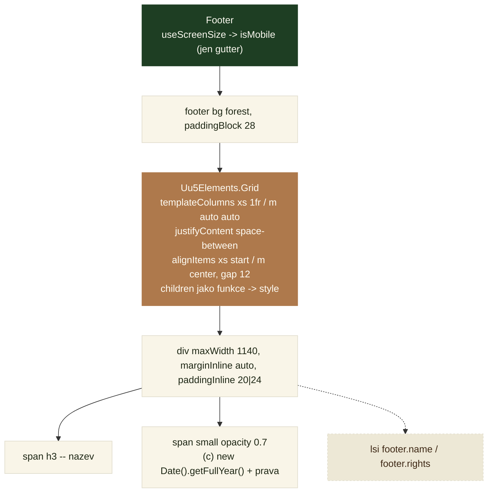
```mermaid
flowchart TD
  FO["Footer<br/>useScreenSize -> isMobile (jen gutter)"]:::own
  FEL["footer bg forest, paddingBlock 28"]:::html
  G["Uu5Elements.Grid<br/>templateColumns xs 1fr / m auto auto<br/>justifyContent space-between<br/>alignItems xs start / m center, gap 12<br/>children jako funkce -> style"]:::uu5
  W["div maxWidth 1140, marginInline auto, paddingInline 20|24"]:::html
  N["span h3 -- nazev"]:::html
  C["span small opacity 0.7<br/>(c) new Date().getFullYear() + prava"]:::html
  L["lsi footer.name / footer.rights"]:::data

  FO --> FEL --> G --> W
  W --> N
  W --> C
  W -.-> L

  classDef own fill:#1E3E23,color:#FBF9F0,stroke:#1E3E23
  classDef html fill:#F9F5E8,color:#1E2715,stroke:#DFDBCB
  classDef uu5 fill:#AE794C,color:#FEFCF4,stroke:#AE794C
  classDef data fill:#EDE8D6,color:#3E2815,stroke:#DFDBCB,stroke-dasharray:3 3
```

---

## A.13 Souhrn: kolik uu5 na webu dnes je

Stav k 2026-09-04 (přepočítáno ze zdrojů). „Naše" znamená vlastní komponenta nebo sémantické
HTML s `Config.Css`.

| Komponenta | uu5 komponenty | Naše |
| --- | --- | --- |
| Rám stránky | **celý** `UiApp.Spa` → `Page` → `Top` + `main` + footer slot, `SpacingProvider type="loose"` | — |
| Header | **celý** `CaioApp.Top`: `ActionGroup`, `Header`, `Link`, `TouchButton`, `Dropdown`, `withStickyTop`, `BackgroundProvider` | — |
| Sdílené primitivy | `Text` (nadpisy), `Tile` (karty), `Button`, `Grid`, `BackgroundProvider` | `Section`, `Eyebrow`, `Photo` + obaly `Heading`/`Card`/`Button` |
| Hero | `Button` ×2, `Text` (h1) | perex, řádek tlačítek (flex kvůli zalamování) |
| Stats | `Grid`, `Text` (expose/lead) | `<dl>`/`<dt>`/`<dd>`, eyebrow popisky |
| O roubence | `Grid` ×5, `Tile` ×6, `Icon` (stencily), `Text` | perex, popisky dlaždic, `Photo` koláž |
| Galerie | `Grid`, `Uu5Imaging.Image` + lightbox | `Photo` placeholder, dokud nejsou fotky |
| Ceník | `Grid` ×4, `Tile` ×4, `Tag`, `Number`, `Text` ×4, `HighlightedBox` | perex, `<ul>` poznámek |
| Rezervace — obal | `Grid` ×2, `BackgroundProvider` ×2 (světlé karty) | perex, `<ul>` podmínek, bílé karty |
| Rezervace — kalendář | `Uu5Elements.Calendar` (`dateMap`, `displayNavigation`, `weekStartDay`), `Pending`, `PlaceholderBox` | legenda |
| Rezervace — formulář | `Uu5Forms.*` celý (7 polí + `SubmitButton`), `Number` ×3, `Icon`, `useAlertBus` | honeypot, box s cenou, potvrzení |
| Recenze | `Grid`, `Tile` ×4 | hvězdičky jako text, citace, autor |
| Zajímavosti | `Grid` ×3, `Tile` ×6, `Number` (km) | perex, `Photo`, popisky |
| Dotazy | **celé** `Accordion` → `Panel` ×5 → `CollapsibleBox`, `Text` | odpověď jako `<p>` |
| Kontakt | `Grid` ×2, `InfoGroup` + 3× `InfoItem`, `Link` ×3, `Text`, `PlaceholderBox`, `Box` (mapa) | `Button`, ``/`<iframe>` mapy |
| Footer | `Grid` | `<footer>`, dva `<span>`y |
| 404 | `Text` (přes `Heading`), `Button` | `<div>`, perex `<p>` |

### Kolik holého HTML zbylo

Census z celého `client/src` (20 souborů `.jsx`), počítáno z otevíracích tagů v JSX,
komentáře odečtené: **62 HTML elementů** proti **57 `Uu5Elements.*` / `Uu5Forms.*` /
`Uu5Imaging.*`** + `BackgroundProvider` ×3 + `UiApp.Spa`/`SpaProvider`. Do HTML čísla se
navíc počítají obaly, které existují jen proto, aby na ně `Grid` položil svůj `style` —
zbytek by na uu5 přejít ani neměl:

| Tag | Kolik | Kde a proč |
| --- | --- | --- |
| `<div>` | 24 | kontejner v `Section`; obaly, na které `Grid` přes `children` jako funkci nasazuje spočítaný `style`; bílé karty rezervace; placeholder v `Photo`; položky `Stats` a ceníku |
| `<p>` | 16 | perexy sekcí, popisky karet, `Eyebrow`, legenda kalendáře, souhlas u formuláře — GDS pro tuhle sazbu odpovídající stupeň nemá |
| `<span>` | 6 | vzdálenost v km, „/ noc", dva texty patičky, popisek placeholderu, kolečko legendy |
| `<ul>` + `<li>` | 2 + 2 | poznámky ceníku a podmínky rezervace — sémantika seznamu, kterou `InfoGroup` nedává (⛔️ bod 6 v [§ B.13](#b13-souhrn-doporučení-podle-výnosu)) |
| `<dl>` + `<dt>` + `<dd>` | 1 + 1 + 1 | pruh statistik — popisný seznam je pro čtečku správnější než `div`y z `InfoGroup`u (⛔️ tamtéž) |
| `` | 2 | `Photo` (dokud fotky nemají `src`) a statická fáze mapy |
| `<iframe>` | 1 | druhá fáze mapy (Embed API) |
| `<strong>` | 2 | autor recenze, cena v potvrzení |
| `<section>` | 1 | `Section` — jeden element pro celý web |
| `<footer>` | 1 | `Footer`; rám kolem něj dodává `UiApp.Spa` |
| `<h3>` | 1 | potvrzení formuláře; zmizí s `PlaceholderBox code="success"`. Nadpisy sekcí `<hN>` staví `Heading` z proměnné `Tag`, takže v tomhle počtu nejsou |
| `<input>` | 1 | honeypot — musí být mimo viewport i mimo tab order, žádná uu5 komponenta to nedělá a dělat nemá |

**Nula** `<a>`, `<button>`, `<nav>`, `<header>`, `<main>`, `<form>`, `<label>` i `<table>` —
tohle všechno dodává uu5 (`Link`, `Button`, `ActionGroup`, `CaioApp.Top`, `UiApp.Spa`,
`Uu5Forms.Form`). Zbylé HTML je jen ve třech kategoriích: **sémantika, kterou GDS nemá**
(`dl`/`ul`/`section`/`hN`), **body text** (`p`, `span` — poslední místo, kde se sází
z `theme.text`), a **naše tři komponenty** `Section`/`Eyebrow`/`Photo`, u kterých je
v [§ B.0](#b0-co-z-uu5-jde-a-co-ne-měřeno-ne-odhadem) změřeno proč.

---

# Část B — cílový stav nad uu5g05

## B.0 Co z uu5 jde a co ne (měřeno, ne odhadem)

Než konkrétní doporučení — čtyři fakta z `node_modules`, na kterých všechno ostatní stojí.
Bez nich se doporučení nedají posoudit.

### ✅ Rádiusy sedí přesně

`RadiusPalette.box`: `elementary` 4px, **`moderate` 8px**, `expressive` 12px.
Náš `theme.radius = 8`. Takže `borderRadius="moderate"` na uu5 komponentě vypadá **identicky**
jako naše karta. Nic se neladí.

### ✅ Spacing sedí až na dvě hodnoty

`SpacingPalette.fixed`: `a`2 `b`4 `c`8 **`d`12 `e`16** `f`20 **`g`24** **`h`32** `i`36 `j`40
**`k`48** `l`64 `m`80.

Naše mezery 12 / 16 / 24 / 32 / 48 jsou přesně `d` / `e` / `g` / `h` / `k`. Mimo mřížku jsou
jen **28** (`marginBlockStart: 28` nad mřížkami sekcí) a **72 / 96** (`sectionPad.m` / `.l`).
Buď se srovnají na 32 / 64 / 80, nebo zůstanou naše — ale `useSpacing()` je použitelný.

### ❌ Barvy povrchů uu5 komponent nejde přenastavit

`ColorPalette.building.light.main = #ffffff`. Na tomhle stojí `Box`, `Block`, `Tile`, `Panel`,
`Accordion` — jejich výchozí `colorScheme="building"` znamená **čistě bílou**.
Náš podklad karty je `#FFFDF9` a stránky `#FBF9F0`; předloha čistou bílou nikde nemá
(viz [ux-design-system.md](./ux-design-system.md)).

`UuGds.setMeaningColor()` (které už voláme v `main.jsx`) zapisuje **jen** do
`overrides.ColorPalette.meaning[...]` — pro `building` **žádný veřejný setter neexistuje**.
Ostatní palety jdou přes `UuGds.getValue()`, což je jen čtení.

→ Každá uu5 plocha bude buď bílá, nebo se jí musí přebít podklad přes `className`.
Tohle je jediný skutečný důvod, proč sekce zůstaly ruční, a **platí dál**.

### ⚠️ Typografie: font family ANO, stupně NE

Tady je předchozí zápis v `decisions.md` **nepřesný**. Změřeno:

- `Uu5Elements.Text` nastavuje z GDS jen `fontSize` / `fontWeight` / `lineHeight`.
  **`fontFamily` v tokenech typografie vůbec není** (jediná výjimka je `Roboto Mono` u `code`).
- Font se bere z globálního pravidla `html { font-family: Roboto, ClearSans, sans-serif }`,
  které uu5g05 injektuje — a `main.jsx` ho **už dnes přebíjí na Karlu**. Takže `Uu5Elements.Text`
  na tomhle webu renderuje v Karle, ne v Robotu. Fraunces jde dodat `className`em, protože
  `font-family` se dědí a `Text` ji nepřepisuje.
- Co dodat **nejde**, jsou **stupně a prostrkání**:

  | | naše | nejbližší GDS |
  | --- | --- | --- |
  | h1 | 60px / 63px / -1.5% | `expose/default/hero` 44/52, `story/heading/h1` 34/40 |
  | h2 | 36px / 40px / -1.5% | `story/heading/h2` 30/36 |
  | h3 | 20px / 28px / -1.2% | `story/heading/h3` 26/32 |
  | eyebrow | 11px / +0.28em (= 3,08px) / uppercase / weight 700 | `interface/highlight/small` 12px / **+0,5px** / uppercase / weight 400 |

  Prostrkání v paletě existuje, ale jen v `interface/highlight/*` a všude se stejnou hodnotou
  **0,5px** — náš eyebrow potřebuje ~3,1px, tedy **šestkrát víc**. U nadpisů
  (`story/heading/*`, `expose/default/*`) není `letterSpacing` vůbec, takže naše záporné
  prostrkání -1,5 % se přes token vyjádřit nedá.

→ **`Heading` a `Eyebrow` zůstávají naše.** `Uu5Elements.Text` má smysl jen tam, kde je uu5
sazba v pořádku — uvnitř formuláře, kalendáře, modalu.

### Závěr § B.0

> ⚠️ **Revidováno 2026-09-03 (majitel).** Původní dělící linie „layout a chování z uu5,
> povrch a sazba naše" **neplatí**. Platí pravidlo: **uu5 komponenty se nastavují propsy**
> a přijímá se, jak vypadají; přestylování (`className` nad uu5 komponentou) se nedělá
> samo od sebe a **musí ho schválit majitel** (viz [decisions.md](./decisions.md), *Frontend*).

**Co je dnes v kódu skutečně přebité** (stav k 2026-09-04, odečteno ze zdrojů). Rozvržení
zvenčí — `marginBlockStart` na `Grid`u, `Accordion`u, `HighlightedBox`u, `InfoGroup`u,
`inlineSize: 100%` na `Box`u mapy — se za přestylování nepočítá; jde o umístění komponenty
na stránce, ne o její vzhled.

| Místo | Co se přebíjí | Schváleno |
| --- | --- | --- |
| `layout/heading.jsx` | `fontFamily: Fraunces` + `textWrap: balance`. Sedí na **našem** `<hN>` uvnitř `children` jako funkce, ne na `Text` — `Text` jen předá spočítaný `style` | ✅ majitel 2026-09-03 |
| `app.jsx`, `TOP.children` | `className` na `Uu5Elements.Header` cílící na `[data-name="Uu5Elements.Text"]` → `fontFamily: Fraunces`. Header sází `title`/`subtitle` s **vlastní explicitní** `font-family`, takže dědění nestačí | ✅ tatáž úvaha o fontu ([§ A.1](#a1-header)) |
| `reservation/reservation-form.jsx`, `Confirmation` | `className` na `Uu5Elements.Icon` → `fontSize: 40` a `color` | ⏳ **nezdokumentované** — zmizí s `PlaceholderBox code="success"` ([§ B.13](#b13-souhrn-doporučení-podle-výnosu), bod 9) |

Font je v obou prvních případech tentýž jeden důvod: v GDS typografii **není žádný token
pro `font-family`**, dědí se z globálního `html { font-family }`, které `main.jsx` nastavuje
na Karlu. Bez těch deklarací by display font ze webu zmizel.

Jak to vyšlo v praxi:

- **Vzato z uu5 bez přebití vzhledu:** `Grid` (**20 míst** v `client/src`), `Button`, `Tile`
  (karty), `Accordion` + `Panel`, `Text` (nadpisy, ceny, čísla statistik, drobné popisky),
  `Number`, `Tag`, `HighlightedBox`, `PlaceholderBox`, `InfoGroup`/`InfoItem`, `Link`,
  `Icon`, `Calendar`, `Pending`, `Box`, `Header`, `SpacingProvider`, `BackgroundProvider`,
  celý `Uu5Forms.*` a `Uu5Imaging.Image` s lightboxem.
- **Vzato s přebitím:** tři místa, viz tabulka výš — dvě kvůli fontu, jedno (`Icon`
  v potvrzení formuláře) je zbytek k odklizení.
- **Zůstalo naše:** `Section` (vertikální rytmus a gutter), `Eyebrow` (prostrkání 0,28 em
  proti 0,5 px v GDS), `Photo` (placeholder plochy). `Heading`, `Card` a `Button` existují
  dál, ale jsou to **obaly nad uu5** — jedno místo, kde se drží propsy pro celý web.
- **Co se nepotvrdilo:** povrchy `Tile`/`Panel` **nemusely** dostat přebitý podklad. GDS má
  varianty, které předloze stačí (`subdued` = bílá + linka bez stínu, `distinct` u panelu
  accordionu), takže cena je jen studenější linka `#E0E0E0` místo teplé `#DFDBCB`
  a čistě bílá místo `#FFFDF9`.

---

## B.1 Header → `withStickyTop`

> ✅ **HOTOVO 2026-09-01, ale jinak, než tenhle návrh předpokládal.** Lišta se nakonec
> nestaví v appce nad `withStickyTop`, ale v `caio-ui` jako `CaioApp.Top`, který se nastavuje
> přes `UiApp.Spa`/`Page` prop `top` (viz [§ A.1](#a1-header) a `caio-ui/README.md`).
> Tři věci se proti návrhu ukázaly jinak:
> 1. **`stickyTopStuck` na stránce scrollované oknem nefunguje** — stub HOC se pozicuje
>    přes CSS `anchor()` a ukotvení se nastaví jen pro `HTMLElement` scroll kontejner.
>    Dosednutí si `Top` proto detekuje sám (sentinel + scroll listener) a stín si kreslí
>    ze stejného GDS efektu (`elevationUpper`).
> 2. **`gatherMetrics: true` se nepoužívá** — s ním hook na každý scroll event nakrátko
>    přepíná lištu na `position: static`, aby změřila offset.
> 3. **Průhledná lišta nad hero se nezachovala** — rozhodnutí je „zelená všude".
>    `transparent` a funkční tvar propsů (`({ stuck }) => …`) v `Top` ale existují.
>
> **Doplněno 2026-09-03:** `visibility` se z `"always"` přepnulo na **`"onScrollUp"`**
> (lišta odjede při scrollu dolů, vrátí se při scrollu nahoru) — a bod 3 návrhu níž
> („`render: false` rozbije detekci `stuck`") se tím potvrdil jako **neškodný**: skrývání
> nestojí na `render()`, ale na tom, že HOC odečte výšku lišty od `top` ve `style`.
> S `render: false` tedy funguje i schovávání, jen `stuck` si `Top` počítá sám.
>
> Diagram níž je původní návrh; ponechaný pro srovnání.

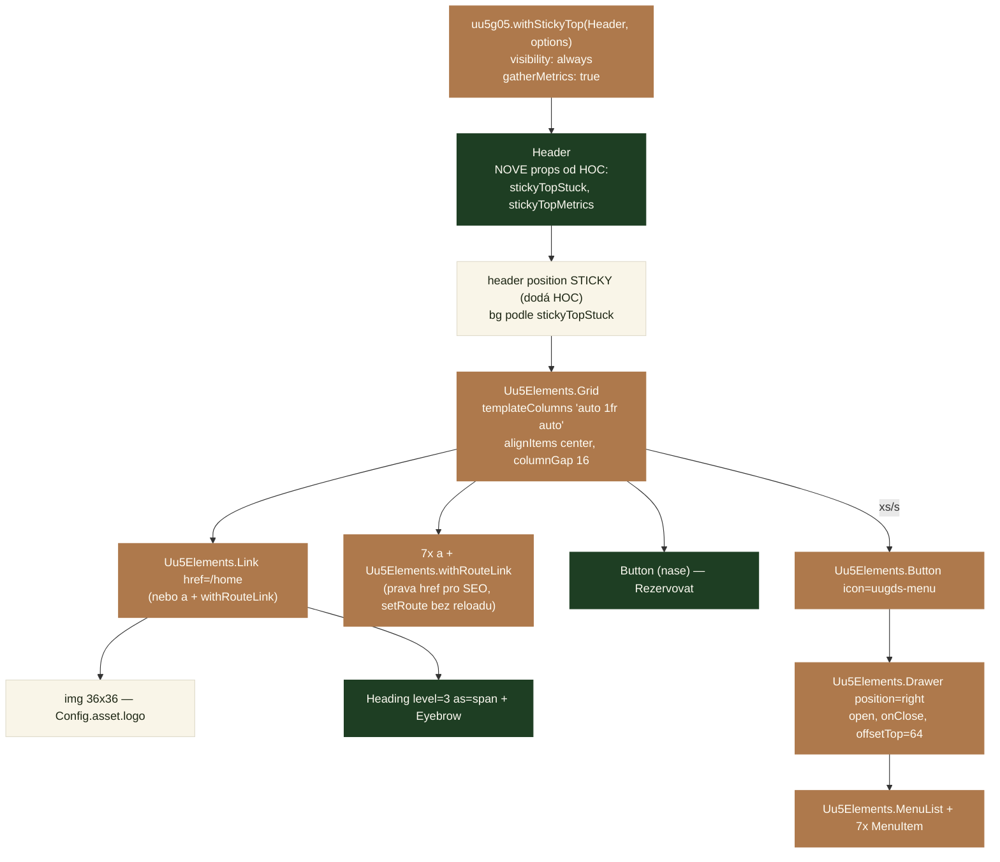
```mermaid
flowchart TD
  W["uu5g05.withStickyTop(Header, options)<br/>visibility: always<br/>gatherMetrics: true"]:::uu5
  H["Header<br/>NOVE props od HOC:<br/>stickyTopStuck, stickyTopMetrics"]:::own
  HEL["header position STICKY (dodá HOC)<br/>bg podle stickyTopStuck"]:::html
  BAR["Uu5Elements.Grid<br/>templateColumns 'auto 1fr auto'<br/>alignItems center, columnGap 16"]:::uu5
  LOGO["Uu5Elements.Link href=/home<br/>(nebo a + withRouteLink)"]:::uu5
  IMG["img 36x36 — Config.asset.logo"]:::html
  NAME["Heading level=3 as=span + Eyebrow"]:::own
  NAV["7x a + Uu5Elements.withRouteLink<br/>(prava href pro SEO, setRoute bez reloadu)"]:::uu5
  BTN["Button (nase) — Rezervovat"]:::own
  MB["Uu5Elements.Button icon=uugds-menu"]:::uu5
  DR["Uu5Elements.Drawer position=right<br/>open, onClose, offsetTop=64"]:::uu5
  ML["Uu5Elements.MenuList + 7x MenuItem"]:::uu5

  W --> H --> HEL --> BAR
  BAR --> LOGO
  LOGO --> IMG
  LOGO --> NAME
  BAR --> NAV
  BAR --> BTN
  BAR -->|"xs/s"| MB --> DR --> ML

  classDef own fill:#1E3E23,color:#FBF9F0,stroke:#1E3E23
  classDef html fill:#F9F5E8,color:#1E2715,stroke:#DFDBCB
  classDef uu5 fill:#AE794C,color:#FEFCF4,stroke:#AE794C
  classDef data fill:#EDE8D6,color:#3E2815,stroke:#DFDBCB,stroke-dasharray:3 3
```

**Co se získá**

- `stickyTopStuck` prop **nahradí celý `useState(scrolled)` + `useEffect` se `scroll`
  listenerem + `SCROLL_THRESHOLD`**. Detekce je přes `IntersectionObserver` nad stub
  elementem, ne přes scroll event — bez přepočtu na každý pixel scrollu.
- `gatherMetrics: true` navíc dá `stickyTopMetrics.offsetToStickyBoundary`, takže překlopení
  barvy může být plynulé, ne binární.
- Skládání víc sticky prvků pod sebe (`stickyOffset` se počítá z předchozích) — kdyby někdy
  přišla druhá lišta, neřeší se offsety ručně.
- `visibility: "onScrollUp"` je hotová varianta „lišta se schová při scrollu dolů".
  **Zapnuto 2026-09-03** jako default `caio-ui` (viz [§ A.1](#a1-header)).
- `Drawer` na mobilu: focus trap, zavření Escapem, animace — místo `menuOpen` a `<nav>`.

**Co se musí vyřešit — tři věci, ne nula**

1. **Je to `position: sticky`, ne `fixed`.** Naše lišta musí hero **překrývat**
   (proto `fixed`, viz komentář v `header.jsx`). Sticky prvek zabere vlastních 64px pruhu
   nad hero. Řešení: hero dostane `marginBlockStart: -HEADER_HEIGHT` a nechá si `padTop`;
   `page.jsx` pak naopak `paddingBlockStart: HEADER_HEIGHT` **přestane potřebovat**, protože
   sticky z toku nevypadává. Čistý zápor to není — jen se posune, kde se ta konstanta použije.
2. **Ve stuck stavu HOC sám dopisuje `backgroundColor`** z `building.light|dark .main`
   (tj. `#ffffff`) do `className` za náš. Podle komentáře v `with-viewport-sticky-bottom.js`
   končí `<style>` naší knihovny v `<head>` později než uu5g05, takže by měl vyhrát náš krém —
   **ale je to potřeba ověřit v prohlížeči**, ne předpokládat.
3. **Ve stuck stavu HOC renderuje stín** (`EffectPalette.elevationUpper`) jako samostatný
   element. Předloha je programově bez stínů (`card.jsx`). `options.render: false` stín vypne,
   ale tím se rozbije i detekce `stuck` (ta stojí na stub elementu z `render()`). Takže:
   ponechat `render: true` a stín potlačit CSS.

---

## B.2 Hero

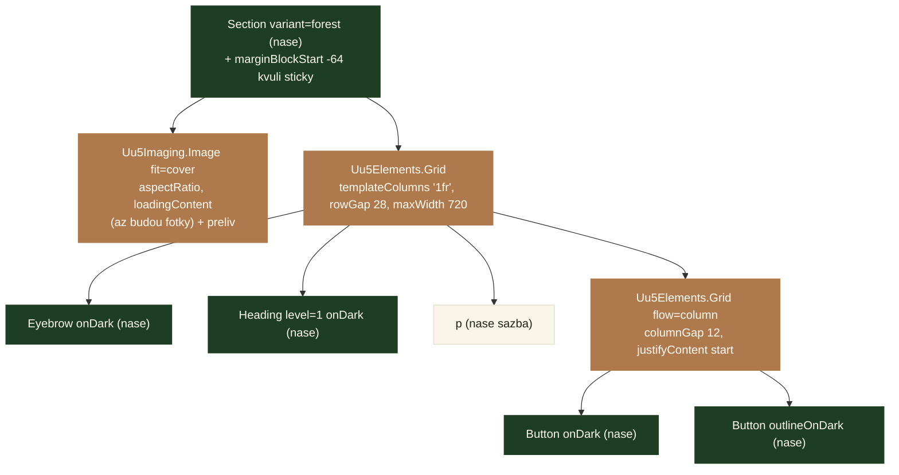
```mermaid
flowchart TD
  S["Section variant=forest (nase)<br/>+ marginBlockStart -64 kvuli sticky"]:::own
  IMGW["Uu5Imaging.Image fit=cover<br/>aspectRatio, loadingContent<br/>(az budou fotky) + preliv"]:::uu5
  G["Uu5Elements.Grid<br/>templateColumns '1fr', rowGap 28, maxWidth 720"]:::uu5
  E["Eyebrow onDark (nase)"]:::own
  H["Heading level=1 onDark (nase)"]:::own
  P["p (nase sazba)"]:::html
  AG["Uu5Elements.Grid flow=column<br/>columnGap 12, justifyContent start"]:::uu5
  B1["Button onDark (nase)"]:::own
  B2["Button outlineOnDark (nase)"]:::own

  S --> IMGW
  S --> G
  G --> E
  G --> H
  G --> P
  G --> AG
  AG --> B1
  AG --> B2

  classDef own fill:#1E3E23,color:#FBF9F0,stroke:#1E3E23
  classDef html fill:#F9F5E8,color:#1E2715,stroke:#DFDBCB
  classDef uu5 fill:#AE794C,color:#FEFCF4,stroke:#AE794C
  classDef data fill:#EDE8D6,color:#3E2815,stroke:#DFDBCB,stroke-dasharray:3 3
```

Hero je z 90 % typografie a barva — tedy přesně to, co z uu5 vzít nejde. Reálný přínos:
`Grid` místo dvou ručních flexů a `Uu5Imaging.Image` (`fit="cover"`, `loadingContent`,
`onLoad`) až dorazí fotka.

**Nepoužívat:** `Uu5Elements.Text category="expose" type="hero"` — 44px místo 60px a bez
prostrkání. `Uu5Elements.ActionGroup` na dvě tlačítka je zbytečný (řeší kolaps do menu).

---

## B.3 Stats

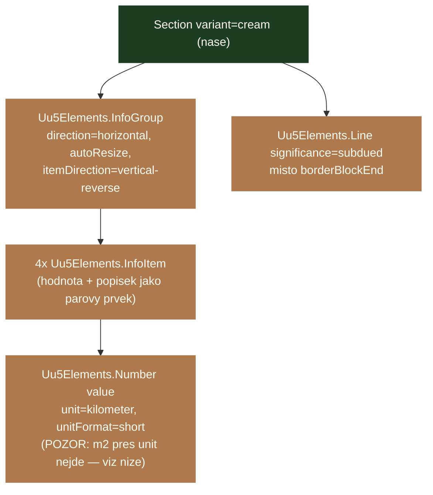
```mermaid
flowchart TD
  S["Section variant=cream (nase)"]:::own
  IG["Uu5Elements.InfoGroup<br/>direction=horizontal, autoResize,<br/>itemDirection=vertical-reverse"]:::uu5
  II["4x Uu5Elements.InfoItem<br/>(hodnota + popisek jako parovy prvek)"]:::uu5
  NUM["Uu5Elements.Number value<br/>unit=kilometer, unitFormat=short<br/>(POZOR: m2 pres unit nejde — viz nize)"]:::uu5
  LINE["Uu5Elements.Line significance=subdued<br/>misto borderBlockEnd"]:::uu5

  S --> IG --> II --> NUM
  S --> LINE

  classDef own fill:#1E3E23,color:#FBF9F0,stroke:#1E3E23
  classDef html fill:#F9F5E8,color:#1E2715,stroke:#DFDBCB
  classDef uu5 fill:#AE794C,color:#FEFCF4,stroke:#AE794C
  classDef data fill:#EDE8D6,color:#3E2815,stroke:#DFDBCB,stroke-dasharray:3 3
```

`InfoItem` / `InfoGroup` je doslova komponenta „hodnota + popisek", `itemDirection="vertical-reverse"`
dá popisek pod číslo — což je náš pruh.

**Kde `Number` na statistikách nepomůže:** `Uu5Elements.Number` staví na `Intl.NumberFormat`
a jeho `unit` bere jen sankcionovaný seznam jednotek. **`square-meter` v něm není** —
ověřeno, `new Intl.NumberFormat("cs-CZ", { style: "unit", unit: "square-meter" })` hodí
`Invalid unit argument`. Takže `1 200 m²` musí zůstat textem (jednotka v LSI). `Number`
s `unit="kilometer"` má smysl u vzdálenosti na hrad Kost a u zajímavostí ([§ B.9](#b9-zajímavosti-v-okolí)),
ne u plochy zahrady.

**Co se ztratí:** `InfoGroup` renderuje `div`y, ne `<dl>` / `<dt>` / `<dd>`. Na veřejném webu
je popisný seznam sémanticky lepší. **Doporučení: ponechat `<dl>` a vzít z uu5 jen `Grid`.**

---

## B.4 O roubence

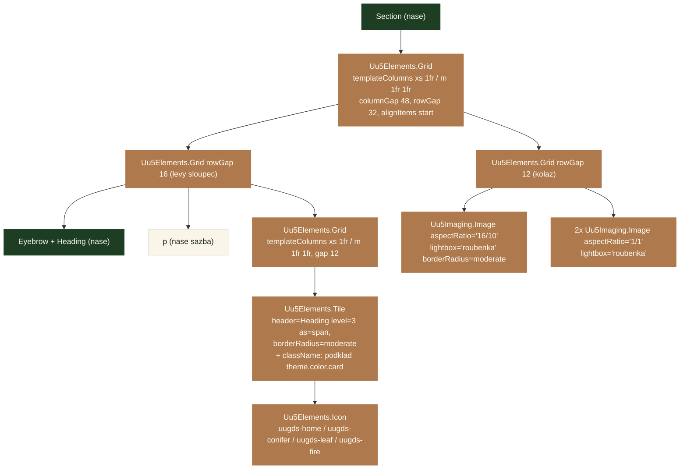
```mermaid
flowchart TD
  S["Section (nase)"]:::own
  G["Uu5Elements.Grid<br/>templateColumns xs 1fr / m 1fr 1fr<br/>columnGap 48, rowGap 32, alignItems start"]:::uu5
  L["Uu5Elements.Grid rowGap 16 (levy sloupec)"]:::uu5
  E["Eyebrow + Heading (nase)"]:::own
  P["p (nase sazba)"]:::html
  AG["Uu5Elements.Grid<br/>templateColumns xs 1fr / m 1fr 1fr, gap 12"]:::uu5
  T["Uu5Elements.Tile<br/>header=Heading level=3 as=span,<br/>borderRadius=moderate<br/>+ className: podklad theme.color.card"]:::uu5
  ICO["Uu5Elements.Icon<br/>uugds-home / uugds-conifer / uugds-leaf / uugds-fire"]:::uu5
  R["Uu5Elements.Grid rowGap 12 (kolaz)"]:::uu5
  I1["Uu5Imaging.Image aspectRatio='16/10'<br/>lightbox='roubenka' borderRadius=moderate"]:::uu5
  I2["2x Uu5Imaging.Image aspectRatio='1/1'<br/>lightbox='roubenka'"]:::uu5

  S --> G
  G --> L
  L --> E
  L --> P
  L --> AG --> T --> ICO
  G --> R
  R --> I1
  R --> I2

  classDef own fill:#1E3E23,color:#FBF9F0,stroke:#1E3E23
  classDef html fill:#F9F5E8,color:#1E2715,stroke:#DFDBCB
  classDef uu5 fill:#AE794C,color:#FEFCF4,stroke:#AE794C
  classDef data fill:#EDE8D6,color:#3E2815,stroke:#DFDBCB,stroke-dasharray:3 3
```

**Klíčový detail:** `Grid` prohání **každý** layout prop přes
`Utils.ScreenSize.getSizeValue(value, contentSize)` a `sizePolicy` má default `"content"`.

> ⚠️ **Opraveno 2026-09-03 (změřeno):** „reaguje na šířku kontejneru" platí **jen uvnitř
> `ContentSizeProvider`u**. `useContentSize("content")` je
> `contentSizeContext?.contentSize ?? useScreenSize()[0]`, a provider zakládá v `uu5g05-elements`
> jenom tělo `Modal`u/`Dialog`u (`_internal/body`, `skipContentSizeProvider`). Na téhle stránce
> žádný provider není, takže `Grid` se rozhoduje podle **viewportu** — tedy stejně jako naše
> `useScreenSize()`. Přínos `Gridu` je proto deklarativní zápis a méně kódu, ne jiné breakpointy;
> kontejnerové by se musely dodat vlastním `ContentSizeProvider`em nad měřenou šířkou.

Fotky v koláži se `lightbox="roubenka"` **automaticky připojí do stejné lightbox skupiny
jako galerie** — návštěvník může z koláže prolistovat celou galerii.

---

## B.5 Galerie — největší výhra

```mermaid
flowchart TD
  S["Section variant=cream (nase)"]:::own
  E["Eyebrow + Heading (nase)"]:::own
  G["Uu5Elements.Grid<br/>templateColumns 'repeat(auto-fill, minmax(240px, 1fr))'<br/>gap 12"]:::uu5
  IMG["Uu5Imaging.Image (1x na fotku)<br/>src, thumbnailSrc, alt,<br/>aspectRatio='4/3', fit=cover,<br/>borderRadius=moderate,<br/>lightbox='roubenka', lightboxTrigger=image,<br/>loadingContent=nas placeholder"]:::uu5
  LB["Lightbox (dodá withLightbox HOC uvnitr Image)<br/>predchozi/dalsi, fullscreen, tmavy backdrop"]:::uu5
  ALT["Uu5Imaging.Gallery imageList<br/>(justified rady) NEBO<br/>Uu5Elements.Carousel stepper=outer buttons=outer"]:::uu5

  S --> E
  S --> G --> IMG --> LB
  S -.->|"alternativa layoutu"| ALT

  classDef own fill:#1E3E23,color:#FBF9F0,stroke:#1E3E23
  classDef html fill:#F9F5E8,color:#1E2715,stroke:#DFDBCB
  classDef uu5 fill:#AE794C,color:#FEFCF4,stroke:#AE794C
  classDef data fill:#EDE8D6,color:#3E2815,stroke:#DFDBCB,stroke-dasharray:3 3
```

`Uu5Imaging.Image` je už z výroby obalený `withLightboxButton` (`lightbox: true`,
`lightboxTrigger: "image"`). Všechny obrázky se **stejným stringem** v `lightbox` tvoří jednu
skupinu s průchodem.

**Co ze `gallery.jsx` zmizí:**

- `<button>` obal kolem každé dlaždice,
- `useState(openIndex)` a `open` derivace,
- `Uu5Elements.Modal`,
- obezlička `useLsi(importLsi, ["gallery", open?.code ?? ""])`, která existuje jen proto, aby
  hook běžel i se zavřeným lightboxem,
- `formatPrice`-like ruční `caption` do hlavičky modalu (`alt` na `Image` bere i funkci).

**Co se získá navíc:** průchod fotkami, fullscreen, `thumbnailSrc` (mřížka tahá malé
náhledy, lightbox originál) — to je při plné galerii rozdíl ve stažených megabajtech.

**Co zůstane naše:** `Photo` pro stav `src: null`. Buď jako `loadingContent`, nebo se
`Photo` použije, dokud fotka není, a `Image` až bude.

---

## B.6 Ceník

```mermaid
flowchart TD
  S["Section (nase)"]:::own
  E["Eyebrow + Heading + p (nase)"]:::own
  G["Uu5Elements.Grid<br/>templateColumns 'repeat(auto-fit, minmax(220px, 1fr))', gap 16"]:::uu5
  T["Uu5Elements.Tile (1x na prah nocí)<br/>significance = highlighted ? 'highlighted' : 'common'<br/>header=Heading level=3 as=span<br/>headerSeparator, borderRadius=moderate<br/>+ className: podklad theme.color.card"]:::uu5
  TAG["Uu5Elements.Tag colorScheme=primary<br/>significance=highlighted<br/>misto rucniho pill span"]:::uu5
  NUM["Uu5Elements.Number<br/>value, currency='CZK', currencyFormat='symbol'<br/>misto formatPrice()"]:::uu5
  IG["Uu5Elements.InfoGroup direction=vertical<br/>2x InfoItem (do 5 osob / od 6 osob)"]:::uu5
  UL["ul poznamky (nase) — nebo InfoGroup"]:::html
  HB["Uu5Elements.HighlightedBox<br/>colorScheme=warning, icon=uugds-info<br/>misto rucniho dashed p"]:::uu5

  S --> E
  S --> G --> T
  T --> TAG
  T --> IG --> NUM
  S --> UL
  S --> HB

  classDef own fill:#1E3E23,color:#FBF9F0,stroke:#1E3E23
  classDef html fill:#F9F5E8,color:#1E2715,stroke:#DFDBCB
  classDef uu5 fill:#AE794C,color:#FEFCF4,stroke:#AE794C
  classDef data fill:#EDE8D6,color:#3E2815,stroke:#DFDBCB,stroke-dasharray:3 3
```

**Tři konkrétní výhry:**

1. `Uu5Elements.Number value={12000} currency="CZK" currencyFormat="symbol" maxDecimalDigits={0}`
   smaže funkci `formatPrice()`, která je **duplikovaná v `pricing.jsx` i v `reservation-form.jsx`**,
   a odstraní natvrdo zapsané `"cs-CZ"` a `"Kč"`. Formát se pak váže na jazyk aplikace —
   což je přesně to, co bude potřeba, až se zapne `en`.
   **`maxDecimalDigits={0}` je povinné:** `Intl` u měny defaultně dává dvě desetinná místa,
   takže bez toho vyjde `12 000,00 Kč` místo dnešního `12 000 Kč` (ověřeno).
2. `Tile significance="highlighted"` nahradí náš trik s `borderWidth: 2` v `card.jsx`.
3. `HighlightedBox colorScheme="warning" icon` je hotová varovná plocha — přesně účel našeho
   ručního `p` s přerušovaným rámečkem u neschváleného ceníku.

**Pozor:** `Tile` header sází `Text` z GDS. Nadpis prahu musí jít dovnitř jako už
nastylovaný node (`header={<Heading level={3} as="span" />}`), jinak přijde o Fraunces.

---

## B.7 Rezervace

### B.7a Obal

```mermaid
flowchart TD
  S["Section variant=forest (nase)"]:::own
  G["Uu5Elements.Grid<br/>templateColumns xs 1fr / m 1fr 1fr<br/>columnGap 48, rowGap 32, alignItems start"]:::uu5
  L["Uu5Elements.Grid rowGap 28"]:::uu5
  E["Eyebrow onDark + Heading onDark + p (nase)"]:::own
  IG["Uu5Elements.InfoGroup direction=vertical<br/>3x InfoItem icon=uugds-clock / uugds-info<br/>misto ul + li"]:::uu5
  BX1["Uu5Elements.Box shape=ground<br/>borderRadius=moderate<br/>+ className: podklad theme.color.card"]:::uu5
  AC["AvailabilityCalendar"]:::own
  BX2["Uu5Elements.Box shape=ground borderRadius=moderate"]:::uu5
  RF["ReservationForm"]:::own

  S --> G
  G --> L
  L --> E
  L --> IG
  L --> BX1 --> AC
  G --> BX2 --> RF

  classDef own fill:#1E3E23,color:#FBF9F0,stroke:#1E3E23
  classDef html fill:#F9F5E8,color:#1E2715,stroke:#DFDBCB
  classDef uu5 fill:#AE794C,color:#FEFCF4,stroke:#AE794C
  classDef data fill:#EDE8D6,color:#3E2815,stroke:#DFDBCB,stroke-dasharray:3 3
```

`Box shape="ground"` má jednu praktickou výhodu proti našemu `<div>`: nastavuje i **barvu
textu** ke svému podkladu, takže odpadne komentovaný trik „bílá karta si `color` MUSÍ přepsat,
jinak je na ní krémový text" z `reservation.jsx`. Podklad ale bude bílý — krém přes `className`.

### B.7b AvailabilityCalendar — druhá největší výhra

```mermaid
flowchart TD
  AC["AvailabilityCalendar<br/>state: occupiedList, error<br/>useEffect -> Calls.getAvailability"]:::own
  ERR["Uu5Elements.PlaceholderBox code=error"]:::uu5
  PEND["Uu5Elements.Pending size=l"]:::uu5
  CAL["Uu5Elements.Calendar<br/>displayNavigation — prepinani mesicu VESTAVENE<br/>selectionMode=single nebo range<br/>min=dnes, weekStartDay=1<br/>dateMap: ISO datum -> colorScheme secondary,<br/>significance highlighted"]:::uu5
  LEG["Legenda: Uu5Elements.Tag colorScheme=secondary<br/>nebo nase p + kolecko"]:::uu5
  API["server: availability/get"]:::data

  AC --> ERR
  AC --> PEND
  AC --> CAL
  AC --> LEG
  AC -.-> API

  classDef own fill:#1E3E23,color:#FBF9F0,stroke:#1E3E23
  classDef html fill:#F9F5E8,color:#1E2715,stroke:#DFDBCB
  classDef uu5 fill:#AE794C,color:#FEFCF4,stroke:#AE794C
  classDef data fill:#EDE8D6,color:#3E2815,stroke:#DFDBCB,stroke-dasharray:3 3
```

`Uu5Elements.Calendar` (na rozdíl od `Uu5Calendar.SimpleCalendar`, na kterém web stál
do 2026-09-02) umí:

| Co dnes řešíme ručně | Čím to nahradí |
| --- | --- |
| hlavička s dvěma chevrony, `shift(months)` | `displayNavigation` |
| `monthLabel` přes `toLocaleDateString("cs-CZ", …)` | totéž, vestavěné (nebo `Uu5Elements.DateTime`) |
| `renderDayIndicator` + `<span>` tečka | `dateMap` — obarví **přímo buňku dne** |
| `weekStartDay={1}` | totéž, plus respektuje `useUserPreferences` |
| — | `min` / `max`, `displayWeekNumbers`, `displayPresets` |

`dateMap` má tvar `{ "<ISO datum>": { colorScheme, significance } }`. `colorScheme="secondary"`
je **už dnes** namapovaný na naši terakotu (`setMeaningColor("secondary", theme.color.accent)`
v `main.jsx`), takže obsazené dny budou v barvě předlohy bez dalšího ladění.

**Úvaha nad rámec refaktoru:** se `selectionMode="range"` může tenhle **jeden** kalendář
zároveň slouzit jako výběr termínu a zrušit `FormDateRange` z formuláře — host by viděl
obsazenost a klikal do ní přímo. Je to změna UX, ne jen implementace, takže to je rozhodnutí,
ne doporučení.

### B.7c ReservationForm

Formulář je už dnes uu5. Zbývají tři místa:

| Dnes | Nahradit |
| --- | --- |
| `Confirmation`: ruční `Uu5Elements.Icon` + `<h3>` + 2× `<p>` | `Uu5Elements.PlaceholderBox code="success"` (má `CODE_MAP`, `header`, `info`) |
| `<div name="price">` s ručním boxem | `Uu5Elements.HighlightedBox` nebo `Box shape="background"` + `Uu5Elements.Number` |
| `formatPrice()` (druhá kopie) | `Uu5Elements.Number currency="CZK"` |

Honeypot `<input>` zůstává ruční — musí být mimo viewport i mimo tab order, žádná uu5
komponenta to nedělá a dělat nemá.

---

## B.8 Recenze

```mermaid
flowchart TD
  S["Section (nase)"]:::own
  E["Eyebrow + Heading (nase)"]:::own
  G["Uu5Elements.Grid<br/>templateColumns 'repeat(auto-fit, minmax(300px, 1fr))', gap 16"]:::uu5
  T["Uu5Elements.Tile (1x na recenzi)<br/>footer = autor + misto<br/>footerSeparator, borderRadius=moderate<br/>+ className: podklad theme.color.card"]:::uu5
  ST["N x Uu5Elements.Icon<br/>icon=uugds-favorites-solid, colorScheme=secondary<br/>ikony aria-hidden, hodnoceni v aria-label wrapperu"]:::uu5
  TX["p citace (nase sazba)"]:::html

  S --> E
  S --> G --> T
  T --> ST
  T --> TX

  classDef own fill:#1E3E23,color:#FBF9F0,stroke:#1E3E23
  classDef html fill:#F9F5E8,color:#1E2715,stroke:#DFDBCB
  classDef uu5 fill:#AE794C,color:#FEFCF4,stroke:#AE794C
  classDef data fill:#EDE8D6,color:#3E2815,stroke:#DFDBCB,stroke-dasharray:3 3
```

Hvězdičky jsou dnes textový znak `★` opakovaný `rating`-krát. `Uu5Elements.Icon` s ikonou
`uugds-favorites-solid` (GDS nemá „star", má „favorites") dá konzistentní vektor napříč
platformami — textový znak se na různých OS kreslí jinak. `aria-label` s hodnocením zůstává,
ikony se doplní `aria-hidden`.

`Tile footer` s `footerSeparator` odpovídá kompozici „citace / oddělovač / autor".

---

## B.9 Zajímavosti v okolí

```mermaid
flowchart TD
  S["Section variant=cream (nase)"]:::own
  T["Uu5Elements.Grid templateColumns xs 1fr / m 1fr 1fr<br/>alignItems center, columnGap 48"]:::uu5
  TL["Eyebrow + Heading + p (nase)"]:::own
  IMG["Uu5Imaging.Image aspectRatio='16/10'<br/>lightbox='okoli'"]:::uu5
  G["Uu5Elements.Grid<br/>'repeat(auto-fit, minmax(260px, 1fr))', gap 16"]:::uu5
  TI["Uu5Elements.Tile (1x na misto)<br/>header=Heading level=3 as=span<br/>headerHorizontalAlignment=start"]:::uu5
  TAG["Uu5Elements.Tag colorScheme=secondary<br/>-> Uu5Elements.Number value=distanceKm<br/>unit='kilometer' unitFormat='short'"]:::uu5
  P["p popis (nase sazba)"]:::html

  S --> T
  T --> TL
  T --> IMG
  S --> G --> TI
  TI --> TAG
  TI --> P

  classDef own fill:#1E3E23,color:#FBF9F0,stroke:#1E3E23
  classDef html fill:#F9F5E8,color:#1E2715,stroke:#DFDBCB
  classDef uu5 fill:#AE794C,color:#FEFCF4,stroke:#AE794C
  classDef data fill:#EDE8D6,color:#3E2815,stroke:#DFDBCB,stroke-dasharray:3 3
```

`Number unit="kilometer" unitFormat="short"` odstraní `{item.distanceKm} km` — jednotka se
lokalizuje sama. `content/attractions.js` si nechá `distanceKm` jako číslo (kvůli řazení),
což je přesně proč tam ta jednotka dnes v JSX je.

---

## B.10 Časté dotazy → `Uu5Elements.Accordion`

```mermaid
flowchart TD
  S["Section (nase)"]:::own
  W["div maxWidth 760 (nase)"]:::html
  E["Eyebrow + Heading (nase)"]:::own
  A["Uu5Elements.Accordion<br/>allowMultiple=false<br/>borderRadius=moderate<br/>itemColorScheme=building<br/>itemList = pole polozek"]:::uu5
  I["itemList polozka -><br/>Uu5Elements.Panel<br/>header, children, initialOpen"]:::uu5
  BX["Box shape=interactiveItem role=button tabIndex=0<br/>aria-expanded / aria-controls"]:::uu5
  TX["Uu5Elements.Text<br/>category=interface segment=interactive type=medium"]:::uu5
  ICO["Uu5Elements.Icon<br/>uugds-chevron-up / -down"]:::uu5
  CB["Uu5Elements.CollapsibleBox<br/>animovane rozbaleni, role=region"]:::uu5
  D["content/faq.js -> itemList<br/>initialOpen na prvni polozce"]:::data

  S --> W
  W --> E
  W --> A --> I
  I --> BX
  BX --> TX
  BX --> ICO
  I --> CB
  A -.-> D
  classDef own fill:#1E3E23,color:#FBF9F0,stroke:#1E3E23
  classDef html fill:#F9F5E8,color:#1E2715,stroke:#DFDBCB
  classDef uu5 fill:#AE794C,color:#FEFCF4,stroke:#AE794C
  classDef data fill:#EDE8D6,color:#3E2815,stroke:#DFDBCB,stroke-dasharray:3 3
```

Zápis se zkrátí na jeden `itemList`:

```jsx
<Uu5Elements.Accordion
  allowMultiple={false}
  borderRadius="moderate"
  itemList={items.map((item, i) => ({
    header: <Heading level={3} as="span" lsi={lsi("faq", item.code, "question")} />,
    initialOpen: i === 0,
    children: <p><Lsi lsi={lsi("faq", item.code, "answer")} /></p>,
  }))}
/>
```

**Co se získá**

- `allowMultiple={false}` = přesně naše „jedna otevřená" logika, `initialOpen` = naše
  „první rozbalená" — obojí bez `useState(openCode)`.
- **`CollapsibleBox` = animované rozbalení.** Dnes odpověď skokem vznikne a zmizí.
- Kompletní ARIA drátování (`aria-expanded`, `aria-controls`, `role="region"`,
  `aria-labelledby`) a obsluha Enter/Space.
- `usePrint()` / `Environment.isSimpleRender` — při tisku se **rozbalí všechny** panely.
  To je věc, kterou by ruční verze musela dodělat zvlášť.

**Co se ztratí — a je toho víc, než se čeká**

1. **Otázka přestane být v `<h3>`.** `Panel` renderuje hlavičku jako `Box` s
   `role="button"` a `tabIndex={0}` — **není to nadpis ani `<button>`**. Na veřejném
   marketingovém webu je osnova dokumentu a strukturovaná data k FAQ argument, který
   animované rozbalení nepřebije.
2. Chevron místo `+` / `−`.
3. Hlavička jde přes `Text category="interface" segment="interactive" type="medium"` —
   řešitelné předaným nastylovaným nodem, ale je to obcházení komponenty.
4. `Accordion` je flex column s **`gap: 4px`** mezi samostatnými panely. Předloha má
   **jeden blok s vlasovými linkami** mezi otázkami. Vizuálně jiná věc; srovná se
   `className`em (gap 0 + border), ale je to boj s komponentou.

**Doporučení:** vzít `Accordion` — animace, tisk a a11y drátování stojí za to — a `<h3>`
řešit `header={<Heading level={3} as="h3">}`. Zanoření `<h3>` uvnitř elementu s
`role="button"` není ideální, ale osnova dokumentu se tím zachová. Kdyby to při ověření
čtečkou vadilo, ruční verze v `faq.jsx` je legitimní volba a **není to technický dluh**.

---

## B.11 Kontakt

```mermaid
flowchart TD
  S["Section variant=cream (nase)"]:::own
  G["Uu5Elements.Grid templateColumns xs 1fr / m 1fr 1fr<br/>alignItems center, columnGap 48, rowGap 32"]:::uu5
  L["Uu5Elements.Grid rowGap 28"]:::uu5
  E["Eyebrow + Heading (nase)"]:::own
  IG["Uu5Elements.InfoGroup direction=vertical<br/>itemDirection=vertical-reverse"]:::uu5
  I1["InfoItem icon=uugds-mapmarker — adresa"]:::uu5
  I2["InfoItem icon=uugds-phone -> Uu5Elements.Link href=tel:"]:::uu5
  I3["InfoItem icon=uugds-email -> Uu5Elements.Link href=mailto:"]:::uu5
  B["Button (nase) — Rezervovat"]:::own
  MAP["Uu5Elements.Box shape=background aspectRatio='4/3'<br/>onClick -> mapUrl<br/>(nebo nase Photo, dokud je to placeholder)"]:::uu5

  S --> G
  G --> L
  L --> E
  L --> IG
  IG --> I1
  IG --> I2
  IG --> I3
  L --> B
  G --> MAP

  classDef own fill:#1E3E23,color:#FBF9F0,stroke:#1E3E23
  classDef html fill:#F9F5E8,color:#1E2715,stroke:#DFDBCB
  classDef uu5 fill:#AE794C,color:#FEFCF4,stroke:#AE794C
  classDef data fill:#EDE8D6,color:#3E2815,stroke:#DFDBCB,stroke-dasharray:3 3
```

Lokální komponenta `Row` v `contact.jsx` je ručně napsaný `InfoItem` — `direction="vertical-reverse"`
dělá „malý popisek nad hodnotou" a `icon` přidá piktogram, který dnes chybí. Tohle je nejčistší
náhrada v celém dokumentu: ubyde vlastní komponenta a přidá se funkce.

`Uu5Elements.Link` má proti `<a>` navíc `colorScheme`, `significance` a ikony; podtržení naším
`borderBlockEnd` v barvě accent se ale musí dodat `className`em, protože GDS má vlastní styl
odkazu.

---

## B.12 Footer

```mermaid
flowchart TD
  F["footer bg forest (nase)"]:::html
  LINE["Uu5Elements.Line significance=subdued<br/>(kdyby oddeleni bylo potreba)"]:::uu5
  G["Uu5Elements.Grid<br/>templateColumns xs 1fr / m auto auto<br/>justifyContent space-between, alignItems center, gap 12"]:::uu5
  N["span h3 — nazev (nase sazba)"]:::html
  C["span small — (c) rok + prava"]:::html
  DT["Uu5Elements.DateTime value dateFormat=... <br/>NEBO nechat new Date().getFullYear()"]:::uu5

  F --> LINE
  F --> G
  G --> N
  G --> C -.-> DT

  classDef own fill:#1E3E23,color:#FBF9F0,stroke:#1E3E23
  classDef html fill:#F9F5E8,color:#1E2715,stroke:#DFDBCB
  classDef uu5 fill:#AE794C,color:#FEFCF4,stroke:#AE794C
  classDef data fill:#EDE8D6,color:#3E2815,stroke:#DFDBCB,stroke-dasharray:3 3
```

Footer je dva texty ve flexu. `Grid` je jediná rozumná změna; `DateTime` na samotný rok je
overkill — `getFullYear()` je v pořádku.

---

## B.13 Souhrn doporučení podle výnosu

Stav k 2026-09-03: ✅ hotovo, ⛔️ neplatí / nedělá se, ⏳ zbývá.

| # | Změna | Stav |
| --- | --- | --- |
| 1 | **Galerie na `Uu5Imaging.Image` + `lightbox`** | ✅ 2026-09-02 |
| 2 | **`Uu5Elements.Calendar` místo `SimpleCalendar`** | ✅ 2026-09-02 |
| 3 | **`Uu5Elements.Grid` napříč sekcemi** | ✅ 2026-09-03, 9 míst. Kontejnerové breakpointy ale **nepřišly** — `Grid` bez `ContentSizeProvider`u měří viewport (viz [§ B.4](#b4-o-roubence)) |
| 4 | **`Uu5Elements.Number`** | ✅ 2026-09-03 — obě kopie `formatPrice()`, `"Kč"`, `"cs-CZ"` i `" km"` pryč |
| 5 | **`withStickyTop` na Header** | ✅ 2026-09-01, ale jinak — lišta se staví v `caio-ui` jako `CaioApp.Top` (viz [§ B.1](#b1-header--withstickytop)) |
| 6 | **`InfoItem` / `InfoGroup`** v kontaktu, statistikách, podmínkách | ✅ v kontaktu (2026-09-03). ⛔️ ve statistikách a podmínkách — `<dl>`/`<ul>` sémantika je cennější, rozvržení tam dělá `Grid` přes `children` jako funkci |
| 7 | **`Tile` / `Box` místo `Card`** | ✅ 2026-09-03 — `card.jsx` je obal nad `Tile`, bez přebití; zvýraznění ceníku je barva plochy, ne 2px rámeček |
| 8 | **`Accordion` v dotazech** | ✅ 2026-09-03 — `<h3>` v osnově zůstalo (jen uvnitř `role="button"`) |
| 9 | **`HighlightedBox`, `PlaceholderBox`** | ✅ `HighlightedBox` u ceníku, `PlaceholderBox` v mapě a kalendáři. ⏳ `PlaceholderBox code=success` místo ručního `Confirmation` ve formuláři |
| 10 | **`Drawer` + `MenuList` na mobilní menu** | ✅ řeší `ActionGroup` v `CaioApp.Top` sám (sbalení do hamburgeru) |
| 11 | **`withRouteLink`** | ✅ `Button` i `Link` ho mají z výroby. **Past:** kvůli němu nejde `Link type="email"`/`"phone"` s holou hodnotou (viz [§ A.11](#a11-kontakt)) |

**Co ještě zbývá (mimo tabulku):** `Uu5Elements.Line` v patičce (kosmetika),
`PlaceholderBox code=success` ve formuláři, a rozhodnutí o `Eyebrow` — `interface/highlight/small`
má prostrkání 0,5 px proti našim 0,28 em, takže by to byl vizuální ústupek.

~~**Co nedělat:** `Uu5Elements.Text` na nadpisy a eyebrow, `Uu5Elements.Button` na CTA
předlohy, `Block.View` jako obal sekce.~~

**Revidováno 2026-09-03 (majitel):** `Text` na nadpisy i `Button` na CTA se **udělaly** a
předloha se jim přizpůsobila (CTA 48 px místo 54, h1 44 px místo 60, h2 30 místo 36).
Vzhled ustupuje jednomu design systému, ne naopak. Nedělá se dál jen `Block.View` jako obal
sekce (`Section` řeší vertikální rytmus a gutter, které GDS nemá) a `Text` na `Eyebrow`
(prostrkání 0,5 px proti 0,28 em).
