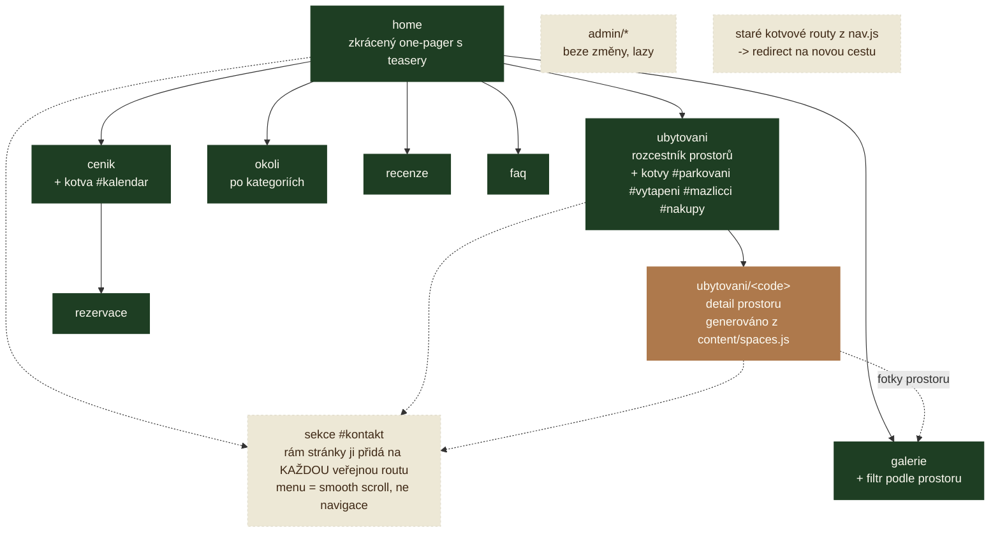

# Návrh: rozpad webu z one-pageru do stromu rout

Návrh struktury webu. Vznikl 2026-09-15 ze zadání „koukni na
[pohadkovaroubenka.cz](https://pohadkovaroubenka.cz/) a navrhni, jak upravit strukturu, aby
to bylo přehlednější a detailní routy mohly zobrazovat detailní info a víc fotek".

> **Stav: SCHVÁLENO A IMPLEMENTOVÁNO (2026-09-15).** Rozhodnutí je zapsané
> v [decisions.md](./decisions.md), § Frontend, a ruší tam *„Web je JEDNA stránka, routy
> sekcí jen přesměrují na kotvu"* z 2026-09-01. Tenhle dokument zůstává jako **odůvodnění
> a rozbor**, ne jako TODO. Fáze 1–4 z [§ 8](#8-postup) jsou hotové včetně obsahu prostorů;
> otevřený zbytek je vyznačený u jednotlivých bodů.
>
> Co se při implementaci ukázalo a v návrhu to nebylo:
> - Přechod na jinou routu **scroll nikam neposouvá** — `RouteProvider` z uu5g05 řeší jen
>   fragment a Zpět/Vpřed. Galerie se proto otevírala uprostřed. Řeší to
>   `useScrollTopOnRouteChange()` v `scroll.js`.
> - `content/attractions.js` už `category` mělo, jen se nepoužívala.
> - Vnořené menu je konfigurace, ne přestylování — viz [§ 7](#7-co-ověřit-než-se-do-toho-půjde) bod 1.

---

## 1. Proč

Dnešní stav ([router.jsx:26](../client/src/router.jsx), `content/nav.js`): jediná routa
`home` skládá deset sekcí pod sebe, menu jen scrolluje na kotvy a staré routy sekcí
(`/galerie`, `/cenik`, …) renderují tutéž `home` se `scrollTo`. Rozhodnutí z 2026-09-01
tím reagovalo na to, že sekce byly krátké a vlastní stránka pro každou z nich byla režie
bez obsahu.

Co se od té doby změnilo a proč to přestává platit:

1. **Obsahu přibývá.** Předloha má u každého prostoru vlastní odstavce (kamna, termostat,
   klimatizace v patře, vybavení koupelen po jednotlivostech) a čtyři pojmenované pokoje
   s kapacitou a fotkami. To se do jedné karty v sekci *O roubence* nevejde a do jednoho
   scrollu taky ne.
2. **Odkaz na detail dnes neexistuje.** Host nemá jak poslat „koukni na tenhle pokoj";
   kotva `#o-roubence` ukáže mřížku deseti dlaždic.
3. **Fotky.** `content/gallery.js` má dnes osm fotek v jedné ploché galerii a jedné
   lightbox skupině (`lightbox="roubenka"`, [component-tree.md § A.5](./component-tree.md#a5-galerie)).
   Jakmile má každý prostor svoji sadu, plochý seznam přestává dávat smysl.
4. **SEO.** Jeden `<title>` a jeden popis na celý web. Fráze jako „ceník pronájmu roubenky"
   nebo „sauna" nemají kam přistát — v předloze každá z nich má vlastní stránku.

Co naopak zůstává v platnosti: **hloubka jen tam, kde je co ukázat.** Předloha sama
nedělá stránku z parkování ani z vytápění — jsou to kotvy na konci rozcestníku.

---

## 2. Co dělá předloha

Dvouúrovňový strom, odečtený z navigace a stránek (2026-09-15):

| Úroveň 1 | Úroveň 2 | Poznámka |
| --- | --- | --- |
| `/ubytovani/` | `/pokoje/`, `/kuchyn/`, `/socialni-zarizeni/`, `/sauna/`, `/myslime-i-na-nejmensi/`, `/venkovni-posezeni-a-zahrada/` | rozcestník s teaser kartami; potomci jsou i v menu |
| `/ubytovani/#doplnujici-informace` | — | parkování, vytápění, mazlíčci, nákupy — **kotvy, ne stránky** |
| `/cenik/` | `#kalendar` | *Kalendář obsazenosti* je položka menu mířící do ceníku, ne vlastní stránka |
| `/galerie/` | — | |
| `/okoli/` | — | seznam s kilometry; nejbližší skiareál 100 m |
| `/darkovy-poukaz/` | — | u nás zatím není co nabídnout |
| `/kontakt/` | — | |
| `/rezervace/` | — | cíl stálého CTA v liště |

Detail (`/pokoje/`) je opravdový detail: nadpis *4 samostatné pokoje*, souhrnný perex
(kapacita 13, Wi-Fi, klimatizace v patře) a pak blok na každý pokoj — název, počet lůžek,
odstavec o tom, čím je zvláštní, a fotky.

Rozcestník i detaily končí stejným blokem *Máte dotaz nebo zájem o pobyt?* s telefonem,
e-mailem a adresou. Kontakt je tak na dosah z každé stránky, ne jen na konci webu.

---

## 3. Navržený strom rout



| Routa | Obsah | Odkud se bere |
| --- | --- | --- |
| `home` | hero, stats, šest karet prostorů (teaser → detail), šest fotek z galerie, ceník v kostce, kalendář + CTA, tři recenze, tři tipy z okolí, kontaktní blok | dnešní sekce, zkrácené |
| `ubytovani` | perex + karta na každý prostor + kotvy s doplňujícími informacemi | nové; přebírá mřížku vybavení z `sections/about.jsx` |
| `ubytovani/<code>` | fotogalerie prostoru, popis, vybavení prostoru, jednotky (pokoje), odkazy na sousední prostory | nové, generované z `content/spaces.js` |
| `galerie` | celá galerie + filtr podle prostoru | `sections/gallery.jsx`, logika beze změny |
| `cenik` | sezóny, co cena zahrnuje, kauce, rekreační poplatek, storno + kotva `#kalendar` | `sections/pricing.jsx` + `AvailabilityCalendar` |
| `rezervace` | formulář na plnou šířku, kalendář, podmínky | `sections/reservation.jsx`, mění se jen rozložení |
| `okoli` | okolí po kategoriích (zima / léto / památky), karty se vzdáleností | `sections/surroundings.jsx` rozšířené |
| `recenze` | všechny recenze (na `home` jen tři) | `sections/reviews.jsx` |
| `faq` | časté dotazy | beze změny, jen vlastní stránka |
| `admin/*` | — | **beze změny**, zůstává lazy (`decisions.md`, § Admin) |

Vlastní routa `kontakt` v seznamu **není** schválně — viz [§ 3a](#3a-kontakt-je-patičková-sekce-všech-rout).

### 3a. Kontakt je patičková sekce všech rout

Kontakt nedostane vlastní stránku. Je to **poslední sekce každé veřejné routy** (tedy i
`ubytovani/<code>`, `cenik`, `okoli`, i `404`) — vykresluje ji rám stránky nad patičkou,
ne jednotlivé routy. Admin ji nemá: tam se rám přepíná podle `isAdminRoute` stejně jako
lišta a patička ([app.jsx](../client/src/app.jsx), `AppFrame`).

Důsledky:

- **Položka *Kontakt* v menu zůstává kotvou `#kontakt`** a chová se jako dnes — plynulý
  scroll na aktuální stránce, žádná navigace. `CaioApp.Top` to umí sám: `href` začínající
  `#` si přeloží na `scrollToAnchor`, cokoli jiného na `setRoute`
  ([caio-ui/src/caio-ui-app/top.jsx](../client/node_modules/caio-ui/src/caio-ui-app/top.jsx),
  `withItemBehaviour`). V `nav.js` je to tedy jediná položka s `anchor` místo `route`.
- Kotva `#kontakt` existuje na každé veřejné routě, takže odkaz nikdy nespadne do prázdna —
  což byl u one-pageru důvod, proč `Reviews` renderuje aspoň prázdnou `<section id="recenze">`.
- Předloha dělá totéž (kontaktní blok opakuje na rozcestníku i na detailech), jen ho má
  jako součást šablony stránky.
- Stará routa `/contact` se proto překlopí na `{ redirect: "home" }` — kontakt je na
  home pořád, jen na konci.

*Dárkový poukaz* v návrhu není: nemovitost ho nenabízí a prázdná stránka je horší než žádná.

---

## 4. Co na kterou stránku patří

**`home`** je po rozpadu výkladní skříň, ne obsah. Každá sekce končí odkazem dovnitř
(`Zobrazit všechny fotky`, `Celý ceník`, `Prohlédnout ubytování`) a žádná nemá ambici být
úplná. Sekce `stats` a `hero` zůstávají beze změny.

**`ubytovani/<code>`** — jeden šablonový layout pro všechny prostory, aby detail nebyl
šest ručně skládaných stránek:

1. nadpis + perex prostoru (LSI `spaces.<code>.title` / `.perex`),
2. fotky prostoru (`Uu5Imaging.Image`, lightbox skupina = kód prostoru),
3. delší popis (LSI `.description`),
4. vybavení prostoru — dlaždice z `amenities.js` filtrované na tenhle prostor,
5. **jednotky**, kde dávají smysl: u `pokoje` čtyři pokoje s kapacitou a vlastním odstavcem;
   u `kuchyne` prázdné,
6. odkaz na předchozí / další prostor + kontaktní blok.

Prostory podle skutečné roubenky (Libošovice 6, viz `content/property.js` a `amenities.js`),
ne podle předlohy — sauna ani oplocená zahrada tu nejsou, zato je stodola a špejchar:

`pokoje`, `kuchyne-a-obyvak`, `koupelny`, `pro-deti`, `stodola`, `spejchar-a-zahrada`.

---

## 5. Změny v content modelu

Dnešní `amenities.js` je plochý seznam ikon a `gallery.js` plochý seznam fotek. Na detailní
routy to nestačí — chybí vazba „co patří ke kterému prostoru".

### Nový `content/spaces.js`

Drží budoucí entitu `space` stejným způsobem, jako dnes `property.js` drží `property`
(ve v3 se import vymění za `Call.cmdGet("space/list")` a stránky se nepřepisují):

```js
{
  code: "pokoje",
  order: 10,
  icon: "uugdsstencil-home-home",
  cover: "/assets/gallery/06-pokoj-1.jpeg",
  galleryCodes: ["atticBedroom", "secondBedroom"],
  amenityCodes: ["beds"],
  units: [{ code: "podkrovni1", beds: 2 }, …],   // prázdné pole, kde nejsou jednotky
}
```

Texty (`title`, `perex`, `description`, názvy a popisy jednotek) jdou do LSI pod
`spaces.<code>.*`, jazykové věci v `.js` nezůstávají — stejné pravidlo jako u ostatního
obsahu.

### Úpravy stávajících souborů

| Soubor | Změna | Proč |
| --- | --- | --- |
| `content/gallery.js` | přidat `space: "<code>"` každé položce | filtr v galerii, výběr fotek na detailu, lightbox skupina po prostorech |
| `content/amenities.js` | přidat `space` (nebo `spaces: []`) | vybavení se ukáže u prostoru i v souhrnu na `ubytovani` |
| `content/attractions.js` | **`category` už tam je** (`culture` / `nature` / `games`) — jen se začne používat | rozpad `okoli` do skupin |
| `content/nav.js` | z `{ code, anchor }` na `{ code, route, children? }`; *Kontakt* si `anchor` ponechá | menu přestává být seznam kotev, kromě kontaktu ([§ 3a](#3a-kontakt-je-patičková-sekce-všech-rout)) |
| `lsi/cs.json` | nový namespace `spaces.*`, `pages.*` (title/description per routa) | viz [§ 7](#7-co-ověřit-než-se-do-toho-půjde), bod 4 |

---

## 6. Router a staré URL

Dynamický segment (`ubytovani/:code`) `useRouter` z uu5g05 nebere — klíče `routeMap` jsou
statické. Routy detailů se proto **generují ze seznamu**, což je přesně vzorec, který
v [router.jsx:30](../client/src/router.jsx) už je pro `nav.js`:

```js
...Object.fromEntries(spaces.map((s) => [`ubytovani/${s.code}`, <SpaceDetail code={s.code} />])),
```

Staré kotvové routy zůstanou, ale místo `<Home scrollTo="#…" />` se z nich stanou
přesměrování (`{ redirect: "galerie" }`, …) — jednou položkou v tomtéž `Object.fromEntries`.
Deep link na `/ubytovani/pokoje` server obslouží sám, catch-all `/*splat` už existuje
(`decisions.md`, § Admin), takže **na serveru se nemění nic**.

`routes/home.jsx` ztrácí prop `scrollTo`; `scroll.js` zůstává pro kotvy uvnitř stránky
(`#kalendar`, `#parkovani`, …) a přibude scroll na začátek při změně routy.

---

## 7. Co ověřit, než se do toho půjde

1. ~~**Dvouúrovňové menu v liště.**~~ **Ověřeno 2026-09-15, jde to propsy.**
   `withItemBehaviour` v [caio-ui/src/caio-ui-app/top.jsx](../client/node_modules/caio-ui/src/caio-ui-app/top.jsx)
   se do `itemList` položky **rekurzivně zanořuje** a dropdownu navěsí `onLabelClick`
   místo `onClick`; sbalování do hamburgeru řeší `Uu5Elements.ActionGroup` sám.
   Vnořené menu je tedy konfigurace `nav.js`, žádné přestylování.
2. **Titulek stránky per routa.** **Hotovo:** `usePageTitle()` v `client/src/page-title.js`,
   volané z `AppFrame`. Název stránky se bere z LSI (tytéž řetězce jako v menu, u detailu
   název prostoru), výsledek je „Ceník · Roubený ráj". `<meta name="description">` per routa
   **zůstává otevřené** — statické `index.html` ho má jedno pro celý web.
3. **Prázdné detaily.** Šest detailů bez fotek a textů je horší než dnešní šest dlaždic.
   Proto fáze v [§ 8](#8-postup) pouštějí prostory po jednom, ne všechny najednou.
4. **Filtr v galerii.** **Hotovo a drží se v URL** (`/galerie?prostor=kuchyne`):
   `setRoute("galerie", { prostor })` zapisuje, `route.params.prostor` čte. Filtrovaný pohled
   jde poslat odkazem a přežije Zpět. Neznámý kód v adrese se chová jako „vše" a prostory
   bez jediné fotky se mezi volbami nenabízejí.

---

## 8. Postup

| # | Krok | Rozbije UI? |
| --- | --- | --- |
| 1 | `content/spaces.js` + `space` do `gallery.js` a `amenities.js`, `category` do `attractions.js` | ne, data se zatím nečtou |
| 2 | routa `ubytovani` + generované `ubytovani/<code>` ze stávajících fotek | ne, přibývá |
| 3 | osamostatnění `cenik`, `galerie`, `okoli`, `rezervace`, `recenze`, `faq`; kontakt do rámu stránky ([§ 3a](#3a-kontakt-je-patičková-sekce-všech-rout)); `home` zkrátit na teasery; staré routy → redirecty | **ano** — tady je zlom |
| 4 | menu na strom, titulky a popisy per routa | ne |
| 5 | obsah: texty prostorů, jednotlivé pokoje, kategorie okolí, fotky | ne |

Krok 3 je jediný nevratný; do té doby je všechno přírůstek a jde zastavit.

---

## 9. Co se tím ztratí

- **Jeden scroll od hero po kontakt.** Host, který dnes jen roluje a potká cestou všechno
  včetně ceny, bude muset kliknout. Kompenzuje to `home` s teasery a stálé CTA v liště.
- **Jednoduchost routeru.** Z deseti řádků `ROUTE_MAP` bude tabulka s generováním
  a redirecty; přibude scroll na začátek při změně routy a titulky per stránka.
- **Jedna lightbox skupina.** Dnes projdeš šipkami celou galerii; po rozdělení po prostorech
  se průchod zastaví na hranici prostoru. Stránka `galerie` proto zůstává s jednou
  společnou skupinou přes všechny fotky.
